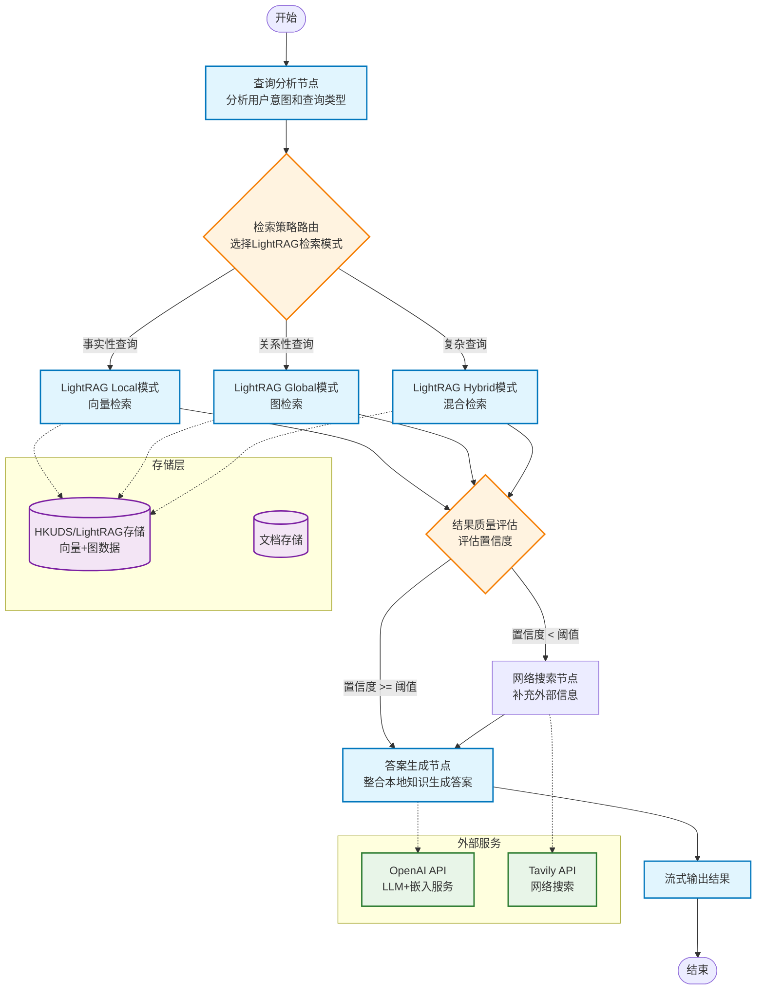
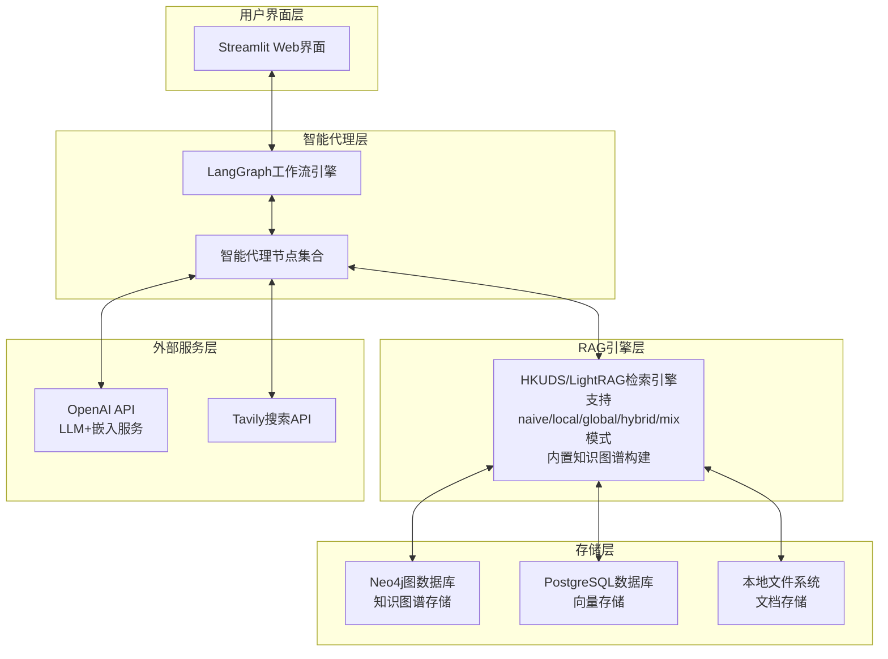
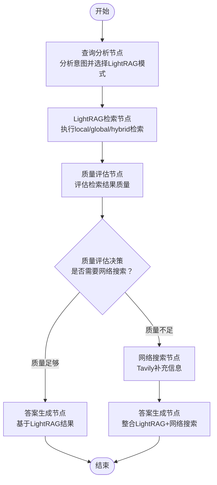
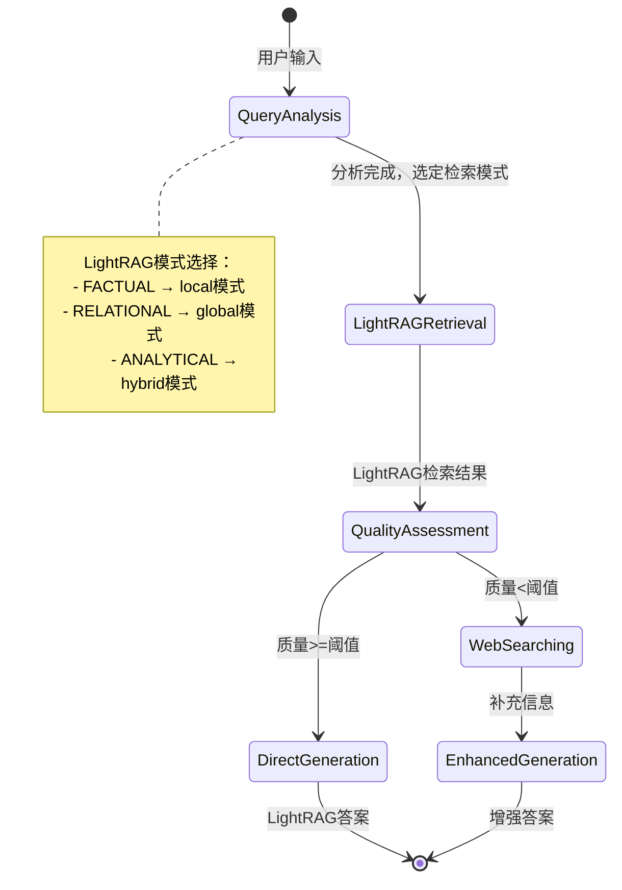
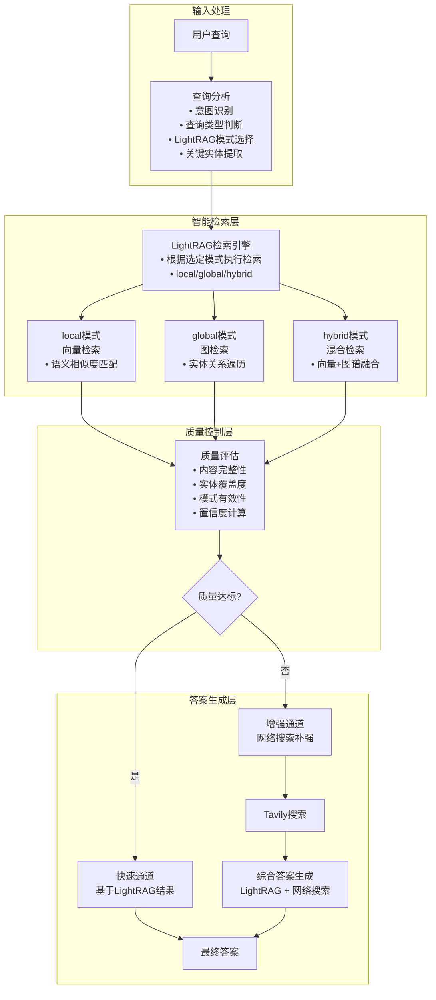
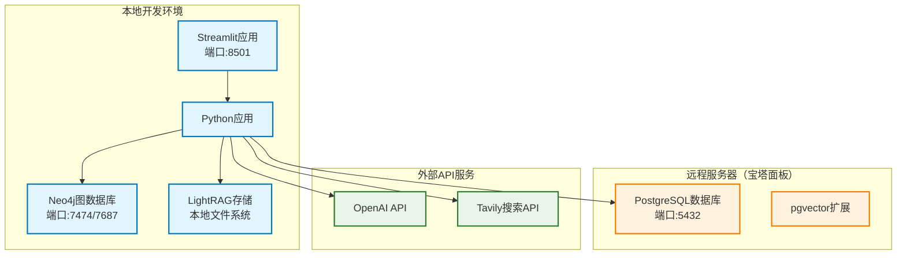

# 智能问答系统技术架构设计文档

## 1. 项目概述与技术背景

### 1.1 项目目标

构建一个基于 Agentic RAG 的智能问答系统，能够自动从本地文档库检索信息，当本地知识不足时智能调用网络搜索，为用户提供准确、全面的答案。

### 1.2 MVP版本功能边界

**MVP 1.0 核心功能**：

- 基于LightRAG的本地知识库检索（支持向量检索和图检索
- 智能质量评估和网络搜索补充
- Streamlit Web界面
- 基本的实时流式显示

**MVP 1.0 不包含**：

- 复杂的多轮对话
- 用户管理和权限控制
- 高级可视化和分析功能
- 前端React页面
- 服务器运维安全
- Graphiti实时图谱更新

### 1.3 技术背景解释

#### 1.3.1 什么是RAG？

**RAG（Retrieval Augmented Generation）**是一种结合信息检索和生成式AI的技术架构：

- **传统方式的问题**：大型语言模型（LLM）虽然强大，但存在知识截止时间限制，无法获取最新信息，且可能产生幻觉（编造不存在的信息）
- **RAG的解决方案**：在生成答案前，先从知识库中检索相关信息，然后基于检索到的真实信息来生成答案
- **优势**：确保答案基于真实数据，可以整合最新信息，减少幻觉现象

#### 1.3.2 什么是Agentic RAG？

**Agentic RAG**是RAG技术的进化版本，引入了智能代理（Agent）的概念：

- **传统RAG**：检索→生成，流程固定
- **Agentic RAG**：智能代理可以根据查询类型和结果质量，动态决定检索策略、是否需要多轮检索、是否调用外部工具等
- **为什么需要**：不同类型的问题需要不同的检索策略，Agentic RAG可以智能选择最佳路径

#### 1.3.3 核心技术组件

**LightRAG**：

- **作用**：轻量级的RAG框架，处理文档向量化、知识图谱构建和检索
- **重要说明**：使用正确的HKUDS/LightRAG框架 (https://github.com/HKUDS/LightRAG)
- **为什么选择**：HKUDS/LightRAG内置多种检索模式（naive、local、global、hybrid、mix），能够同时进行向量检索和图检索，满足不同查询需求
- **检索模式**：
  - naive模式：基础检索模式
  - local模式：纯向量检索，适合事实性查询
  - global模式：图检索，适合关系性查询
  - hybrid模式：混合检索，适合复杂分析性查询
  - mix模式：综合模式

**LangGraph**：

- **作用**：智能工作流编排引擎
- **为什么需要**：根据查询类型动态选择最佳检索策略，实现智能路由和质量评估

**数据存储**：

- **LightRAG内置存储**：负责向量存储、图数据管理和文档处理
- **Neo4j**：图数据库，存储LightRAG生成的知识图谱
- **PostgreSQL**：关系数据库，支持向量扩展，存储文档元数据

### 1.4 MVP核心功能

- **智能问答**：自然语言交互，理解用户意图并选择合适的检索策略
- **多模式检索**：基于LightRAG的local/global/hybrid检索模式
- **质量评估**：智能评估检索结果质量，决定是否需要补充搜索
- **网络搜索补充**：当本地知识置信度不足时，自动调用网络搜索补充信息
- **实时流式显示**：用户可以看到系统的思考过程和信息来源

### 1.5 MVP技术栈

#### 核心框架

- **HKUDS/LightRAG**: 轻量级RAG引擎，负责文档处理、向量检索、知识图谱构建和检索
- **LangGraph**: 智能代理工作流编排
- **Streamlit**: 前端界面和用户交互

#### 数据存储

- **Neo4j**: 图数据库，存储HKUDS/LightRAG生成的知识图谱
- **PostgreSQL**: 关系数据库，支持pgvector扩展，存储向量数据
- **本地文件系统**: 原始文档存储

#### 外部服务

- **OpenAI API**: LLM服务和嵌入模型
- **Tavily API**: 网络搜索服务

## 2. 系统架构设计

### 2.1 MVP智能检索工作流程图



### 2.2 MVP系统架构分层



### 2.3 MVP架构设计理念

#### 2.3.1 简化架构的优势

**MVP设计原则**：

- **单一职责**：HKUDS/LightRAG专注于所有检索任务，避免技术栈复杂化
- **快速迭代**：使用成熟稳定的组件，减少集成风险
- **资源优化**：减少外部依赖，降低部署和维护成本

**智能路由的价值**：

- **策略选择**：根据查询类型选择最适合的HKUDS/LightRAG检索模式
- **质量保证**：智能评估结果质量，决定是否需要外部补充
- **用户体验**：提供实时反馈和透明的处理过程

#### 2.3.2 MVP数据流转过程

**第一步：查询分析**

```
用户输入 → 查询分析节点 → 确定查询类型和检索策略
```

- **目的**：理解用户查询意图，选择最适合的HKUDS/LightRAG检索模式
- **策略选择**：
  - 事实性查询 → local模式（向量检索）
  - 关系性查询 → global模式（图检索）
  - 复杂查询 → hybrid模式（混合检索）

**第二步：智能检索**

```
查询类型 → 选择HKUDS/LightRAG模式 → 执行检索 → 获取结果
```

- **local模式**：基于向量相似性找到相关文档片段
- **global模式**：基于图关系找到实体连接和关系信息
- **hybrid模式**：结合向量和图检索，提供最全面的信息

**第三步：质量评估**

```
检索结果 → 置信度评估 → 决定是否需要网络搜索
```

- **评估维度**：信息完整性、相关性、可信度
- **智能决策**：根据置信度阈值决定是否补充外部信息

**第四步：答案生成**

```
本地结果 + 网络补充 → LLM融合生成 → 标注来源输出
```

- **信息整合**：优先使用本地可信信息，网络信息作为补充
- **透明输出**：清楚标明每个信息的来源和置信度

## 3. LangGraph节点详细实现

### 3.1 每个节点的功能解释与代码实现

#### 3.1.1 查询分析节点 (QueryAnalysisNode)

**节点作用**：理解用户的查询意图，选择最佳的LightRAG检索策略
**为什么需要**：不同类型的问题需要不同的LightRAG检索模式

- 事实性问题："什么是机器学习？" → 适合local模式（向量检索）
- 关系性问题："谁发明了机器学习？" → 适合global模式（图检索）
- 复杂分析："机器学习对未来的影响？" → 适合hybrid模式（混合检索）

```python
from typing import TypedDict
from langgraph import StateGraph
from langchain_openai import ChatOpenAI
import json

class AgentState(TypedDict):
    user_query: str
    query_type: str
    processed_query: str
    lightrag_mode: str
    lightrag_results: dict
    web_results: list
    confidence_score: float
    need_web_search: bool
    final_answer: str
    sources: list

def query_analysis_node(state: AgentState):
    """分析用户查询，判断查询类型并选择最佳LightRAG检索模式"""
    llm = ChatOpenAI(model="gpt-4", temperature=0)
  
    analysis_prompt = f"""
    分析以下用户查询，确定最适合的LightRAG检索模式：
  
    查询：{state["user_query"]}
  
    请判断查询类型并选择检索模式：
    1. FACTUAL (事实性) → local模式: 寻找具体事实、定义、概念
    2. RELATIONAL (关系性) → global模式: 探索实体间关系、影响、联系
    3. ANALYTICAL (分析性) → hybrid模式: 需要综合分析、推理、多维信息
  
    返回JSON格式：
    {{
        "query_type": "FACTUAL/RELATIONAL/ANALYTICAL",
        "lightrag_mode": "local/global/hybrid",
        "key_entities": ["实体1", "实体2"],
        "processed_query": "优化后的查询",
        "reasoning": "选择该模式的原因"
    }}
    """
  
    result = llm.invoke(analysis_prompt)
    analysis = json.loads(result.content)
  
    return {
        "query_type": analysis["query_type"],
        "lightrag_mode": analysis["lightrag_mode"],
        "processed_query": analysis["processed_query"],
        "key_entities": analysis["key_entities"],
        "mode_reasoning": analysis["reasoning"]
    }
```

#### 3.1.2 LightRAG检索节点

**节点作用**：基于查询分析结果，使用对应的LightRAG检索模式获取相关信息
**为什么重要**：LightRAG是唯一的知识检索引擎，其多模式检索能力确保获得最相关的信息

```python
from lightrag import LightRAG, QueryParam

def lightrag_retrieval_node(state: AgentState):
    """使用LightRAG进行智能检索"""
  
    # 初始化LightRAG客户端（配置Neo4j和PostgreSQL）
    lightrag_client = LightRAG(
        working_dir="./rag_storage",
        llm_model_func=gpt_4o_mini_complete,
        embedding_func=EmbeddingFunc(
            embedding_dim=3072,
            max_token_size=8192,
            func=lambda texts: openai_embed(texts, model="text-embedding-3-large")
        ),
        graph_storage="Neo4JStorage",
        vector_storage="PGVectorStorage",
        chunk_token_size=1200,
        chunk_overlap_token_size=100
    )
  
    # 根据查询分析结果选择检索模式
    retrieval_mode = state.get("lightrag_mode", "hybrid")
    processed_query = state.get("processed_query", state["user_query"])
  
    # 执行LightRAG检索
    try:
        results = lightrag_client.query(
            processed_query,
            param=QueryParam(mode=retrieval_mode)
        )
    
        # 计算检索质量分数
        quality_score = calculate_retrieval_quality(results, retrieval_mode)
    
        return {
            "lightrag_results": {
                "content": results,
                "mode": retrieval_mode,
                "query": processed_query,
                "source": "lightrag"
            },
            "retrieval_score": quality_score,
            "retrieval_success": True
        }
  
    except Exception as e:
        return {
            "lightrag_results": {"error": str(e)},
            "retrieval_score": 0.0,
            "retrieval_success": False
        }

def calculate_retrieval_quality(results: str, mode: str) -> float:
    """计算LightRAG检索结果的质量分数"""
    if not results or len(results.strip()) < 50:
        return 0.1
  
    # 基于内容长度和模式的基础分数
    content_length = len(results)
    base_score = min(content_length / 1000, 0.8)  # 基于内容长度
  
    # 根据检索模式调整分数
    mode_bonus = {
        "local": 0.1,    # 向量检索相对简单
        "global": 0.15,  # 图检索更复杂
        "hybrid": 0.2    # 混合检索最全面
    }.get(mode, 0.1)
  
    total_score = min(base_score + mode_bonus, 1.0)
    return total_score
```

#### 3.1.3 结果质量评估节点

**节点作用**：评估LightRAG检索结果的质量，决定是否需要网络搜索补充
**为什么重要**：避免不必要的网络搜索，提高响应速度；确保信息充分性

```python
def quality_assessment_node(state: AgentState):
    """评估LightRAG检索结果质量，决定是否需要网络搜索"""
  
    lightrag_results = state.get("lightrag_results", {})
    retrieval_success = state.get("retrieval_success", False)
  
    if not retrieval_success:
        # 检索失败，必须进行网络搜索
        return {
            "confidence_score": 0.0,
            "need_web_search": True,
            "assessment_reason": "LightRAG检索失败，需要网络搜索补充"
        }
  
    # 置信度评估标准
    confidence_factors = {
        "retrieval_score": state.get("retrieval_score", 0) * 0.4,
        "content_completeness": evaluate_content_completeness(lightrag_results) * 0.3,
        "entity_coverage": evaluate_entity_coverage(state) * 0.2,
        "mode_effectiveness": evaluate_mode_effectiveness(state) * 0.1
    }
  
    total_confidence = sum(confidence_factors.values())
  
    # 根据查询类型设置动态阈值
    query_type = state.get("query_type", "ANALYTICAL")
    threshold_map = {
        "FACTUAL": 0.7,     # 事实查询要求较高置信度
        "RELATIONAL": 0.6,  # 关系查询中等置信度
        "ANALYTICAL": 0.5   # 分析查询较低置信度
    }
    threshold = threshold_map.get(query_type, 0.6)
  
    need_web_search = total_confidence < threshold
  
    return {
        "confidence_score": total_confidence,
        "confidence_breakdown": confidence_factors,
        "need_web_search": need_web_search,
        "confidence_threshold": threshold,
        "assessment_reason": f"置信度 {total_confidence:.2f} {'<' if need_web_search else '>='} 阈值 {threshold}"
    }

def evaluate_entity_coverage(state):
    """评估关键实体覆盖度"""
    expected_entities = state.get("key_entities", [])
    if not expected_entities:
        return 1.0
  
    lightrag_content = state.get("lightrag_results", {}).get("content", "")
    if not lightrag_content:
        return 0.0
  
    # 检查关键实体是否在检索结果中被提及
    found_count = 0
    for entity in expected_entities:
        if entity.lower() in lightrag_content.lower():
            found_count += 1
  
    coverage = found_count / len(expected_entities)
    return coverage

def evaluate_content_completeness(lightrag_results: dict) -> float:
    """评估内容完整性"""
    content = lightrag_results.get("content", "")
    if not content:
        return 0.0
  
    content_length = len(content.strip())
  
    # 基于内容长度评估完整性
    if content_length >= 1000:
        return 1.0
    elif content_length >= 500:
        return 0.8
    elif content_length >= 200:
        return 0.6
    elif content_length >= 100:
        return 0.4
    else:
        return 0.2

def evaluate_mode_effectiveness(state) -> float:
    """评估检索模式的有效性"""
    query_type = state.get("query_type", "")
    lightrag_mode = state.get("lightrag_mode", "")
  
    # 检查模式与查询类型的匹配度
    ideal_matches = {
        "FACTUAL": "local",
        "RELATIONAL": "global", 
        "ANALYTICAL": "hybrid"
    }
  
    if ideal_matches.get(query_type) == lightrag_mode:
        return 1.0  # 完美匹配
    elif lightrag_mode == "hybrid":
        return 0.8  # hybrid模式通常表现良好
    else:
        return 0.6  # 次优匹配
```

#### 3.1.4 网络搜索节点

**节点作用**：当本地信息不足时，从网络获取补充信息
**什么时候触发**：质量评估节点判定需要补充信息时

```python
from tavily import TavilySearchAPIWrapper

def web_search_node(state: AgentState):
    """网络搜索补充信息"""
  
    # 只有当需要网络搜索时才执行
    if not state.get("need_web_search", False):
        return {"web_results": []}
  
    # 初始化Tavily搜索
    tavily_search = TavilySearchAPIWrapper(
        tavily_api_key=os.getenv("TAVILY_API_KEY")
    )
  
    # 基于查询类型优化搜索策略
    if state["query_type"] == "FACTUAL":
        search_mode = "factual"
        max_results = 3
    elif state["query_type"] == "ANALYTICAL":
        search_mode = "comprehensive" 
        max_results = 5
    else:
        search_mode = "balanced"
        max_results = 4
  
    search_results = tavily_search.search(
        query=state["processed_query"],
        search_depth=search_mode,
        max_results=max_results,
        include_answer=True,
        include_raw_content=False
    )
  
    # 处理搜索结果
    processed_results = []
    for result in search_results:
        processed_results.append({
            "title": result.get("title", ""),
            "content": result.get("content", ""),
            "url": result.get("url", ""),
            "score": result.get("score", 0),
            "source_type": "web_search"
        })
  
    return {
        "web_results": processed_results,
        "web_search_summary": f"从网络获取 {len(processed_results)} 个补充信息"
    }
```

#### 3.1.5 答案生成节点

**节点作用**：整合LightRAG检索结果和网络搜索补充信息，生成最终答案
**为什么是核心**：这是用户最终看到的结果，需要准确、全面、有说服力

```python
def answer_generation_node(state: AgentState):
    """整合LightRAG和网络搜索结果生成最终答案"""
  
    llm = ChatOpenAI(model="gpt-4", temperature=0.1)
  
    # 整合所有上下文信息
    context_parts = []
    sources = []
  
    # LightRAG检索结果
    lightrag_results = state.get("lightrag_results", {})
    if lightrag_results.get("content"):
        context_parts.append(f"知识库检索信息（{lightrag_results.get('mode', 'unknown')}模式）：\n{lightrag_results['content']}")
        sources.append({
            "type": "lightrag_knowledge",
            "mode": lightrag_results.get("mode", "unknown"),
            "confidence": state.get("retrieval_score", 0),
            "query": lightrag_results.get("query", "")
        })
  
    # 网络搜索补充结果
    if state.get("web_results"):
        web_context = format_web_results(state["web_results"])
        context_parts.append(f"网络搜索补充信息：\n{web_context}")
        for result in state["web_results"]:
            sources.append({
                "type": "web_search",
                "title": result.get("title", ""),
                "url": result.get("url", ""),
                "score": result.get("score", 0)
            })
  
    # 构建最终提示词
    full_context = "\n\n".join(context_parts)
    lightrag_mode = lightrag_results.get("mode", "unknown")
  
    answer_prompt = f"""
    基于以下信息回答用户问题：
  
    用户问题：{state["user_query"]}
    查询类型：{state.get("query_type", "UNKNOWN")}
    检索模式：{lightrag_mode}
  
    可用信息：
    {full_context}
  
    请遵循以下要求：
    1. 优先使用LightRAG知识库的信息作为主要答案来源
    2. 用网络搜索结果补充最新信息或填补知识空白
    3. 清楚标注信息来源（知识库 vs 网络搜索）
    4. 如果信息不足或存在矛盾，明确说明
    5. 提供结构化、易懂的答案
    6. 根据检索模式调整答案风格：
       - local模式：提供准确的事实性答案
       - global模式：强调实体关系和联系
       - hybrid模式：提供全面的综合分析
  
    格式要求：
    - 主要答案
    - 详细解释（如果需要）
    - 相关补充信息
    - 信息来源说明
    """
  
    answer_result = llm.invoke(answer_prompt)
  
    return {
        "final_answer": answer_result.content,
        "sources": sources,
        "context_used": len(context_parts),
        "lightrag_mode_used": lightrag_mode,
        "answer_confidence": calculate_answer_confidence(state)
    }

def format_web_results(web_results):
    """格式化网络搜索结果"""
    formatted = []
    for i, result in enumerate(web_results[:3], 1):  # 只显示前3个结果
        title = result.get("title", "未知标题")
        content = result.get("content", "")[:200]
        url = result.get("url", "")
      
        formatted.append(f"{i}. {title}")
        if content:
            formatted.append(f"   {content}...")
        formatted.append(f"   来源：{url}")
  
    return "\n".join(formatted)

def calculate_answer_confidence(state):
    """计算最终答案的置信度"""
    base_confidence = state.get("confidence_score", 0.5)
  
    # 根据信息来源数量和质量调整
    source_bonus = 0
  
    # LightRAG结果的质量奖励
    if state.get("lightrag_results", {}).get("content"):
        lightrag_mode = state.get("lightrag_mode", "")
        mode_bonus = {
            "local": 0.15,
            "global": 0.2,
            "hybrid": 0.25  # hybrid模式获得最高奖励
        }.get(lightrag_mode, 0.1)
        source_bonus += mode_bonus
  
    # 网络搜索补充的奖励
    web_results = state.get("web_results", [])
    if web_results:
        web_bonus = min(len(web_results) * 0.05, 0.15)  # 最多0.15的奖励
        source_bonus += web_bonus
  
    # 检索成功的基础奖励
    if state.get("retrieval_success", False):
        source_bonus += 0.1
  
    final_confidence = min(base_confidence + source_bonus, 1.0)
    return final_confidence
```

### 3.2 LangGraph工作流构建

#### 3.2.1 简化的智能检索策略

**核心设计思路**：

1. **查询分析** → 判断最佳LightRAG检索模式（local/global/hybrid）
2. **智能检索** → 使用选定的LightRAG模式执行检索
3. **质量评估** → 评估检索结果是否足以回答问题
4. **条件分支** → 质量足够→直接生成答案；质量不足→网络搜索补充

**LangGraph工作流程图**：



**简化架构的优势**：

- **流程清晰**：直线型工作流，易于理解和维护
- **专注核心**：以LightRAG为唯一知识检索引擎，避免技术栈复杂化
- **智能决策**：根据查询类型自动选择最优的LightRAG检索模式

**状态流转图**：



**数据流转详图**：



#### 3.2.2 简化的工作流代码实现

**核心状态定义**：

```python
from typing import TypedDict, Literal
from langgraph import StateGraph, END

class AgentState(TypedDict):
    # 输入
    user_query: str
    processed_query: str
    session_id: str
  
    # 分析结果
    query_type: Literal["factual", "relational", "analytical"] 
    key_entities: list[str]
  
    # 路由控制
    next_node: str
    retrieval_mode: str
  
    # 检索结果
    retrieval_results: dict
    quality_score: float
    confidence_level: str
  
    # 决策结果
    needs_web_search: bool
    web_results: list = None
  
    # 最终输出
    final_answer: str
    sources: dict
```

**简化的节点实现**：

```python
def query_analysis_node(state: AgentState) -> AgentState:
    """分析查询类型和意图"""
    llm = ChatOpenAI(model="gpt-4", temperature=0)
  
    analysis_prompt = f"""
    分析用户查询的类型和意图：
  
    查询: {state["user_query"]}
  
    查询类型分类：
    1. factual: 寻找定义、概念、具体事实
    2. relational: 探索关系、影响、连接
    3. analytical: 复杂分析、综合判断
  
    返回JSON: {{"type": "factual/relational/analytical", "entities": ["实体1", "实体2"], "processed_query": "优化后的查询"}}
    """
  
    result = llm.invoke(analysis_prompt)
    analysis = json.loads(result.content)
  
    state.update({
        "query_type": analysis["type"], 
        "key_entities": analysis["entities"],
        "processed_query": analysis["processed_query"]
    })
    return state

def strategy_routing_node(state: AgentState) -> AgentState:
    """策略路由节点：根据查询类型决定下一个执行的节点"""
    query_type = state["query_type"]
  
    # 设置下一个节点的路由
    if query_type == "factual":
        next_node = "vector_retrieval"
    elif query_type == "relational":
        next_node = "graph_retrieval"
    else:  # analytical
        next_node = "hybrid_retrieval"
  
    state["next_node"] = next_node
    state["retrieval_mode"] = query_type
    return state

def vector_retrieval_node(state: AgentState) -> AgentState:
    """向量检索节点：LightRAG local模式"""
    query = state.get("processed_query", state["user_query"])
  
    # 使用LightRAG的local模式进行向量检索
    results = lightrag_client.query(query, param=QueryParam(mode="local"))
  
    state["retrieval_results"] = {
        "content": results,
        "mode": "local",
        "retrieval_type": "vector",
        "source": "lightrag_local"
    }
    return state

def graph_retrieval_node(state: AgentState) -> AgentState:
    """图谱检索节点：LightRAG global模式"""
    query = state.get("processed_query", state["user_query"])
  
    # 使用LightRAG的global模式进行图谱检索
    results = lightrag_client.query(query, param=QueryParam(mode="global"))
  
    state["retrieval_results"] = {
        "content": results,
        "mode": "global", 
        "retrieval_type": "graph",
        "source": "lightrag_global"
    }
    return state

def hybrid_retrieval_node(state: AgentState) -> AgentState:
    """混合检索节点：LightRAG hybrid模式"""
    query = state.get("processed_query", state["user_query"])
  
    # 使用LightRAG的hybrid模式进行混合检索
    results = lightrag_client.query(query, param=QueryParam(mode="hybrid"))
  
    state["retrieval_results"] = {
        "content": results,
        "mode": "hybrid",
        "retrieval_type": "hybrid", 
        "source": "lightrag_hybrid"
    }
    return state

def quality_assessment_node(state: AgentState) -> AgentState:
    """评估检索质量，决定是否需要网络搜索"""
    llm = ChatOpenAI(model="gpt-4", temperature=0)
  
    assessment_prompt = f"""
    评估检索结果是否足以回答查询：
  
    用户查询: {state["user_query"]}
    检索结果: {state["retrieval_results"]}
  
    评估标准：
    1. 信息完整性 (0-10)
    2. 直接相关性 (0-10) 
    3. 权威性/可信度 (0-10)
  
    总分>=24且信息完整 → 无需网络搜索
    总分<24或信息过时 → 需要网络搜索
  
    返回JSON: {{"total_score": 0-30, "needs_web_search": true/false, "confidence": "high/medium/low"}}
    """
  
    result = llm.invoke(assessment_prompt)
    assessment = json.loads(result.content)
  
    state.update({
        "quality_score": assessment["total_score"],
        "needs_web_search": assessment["needs_web_search"],
        "confidence_level": assessment["confidence"]
    })
    return state

def web_search_node(state: AgentState) -> AgentState:
    """网络搜索补充信息"""
    search_results = tavily_client.search(
        query=state["user_query"],
        max_results=5,
        search_depth="advanced"
    )
    state["web_results"] = search_results
    return state

def build_agentic_rag_workflow():
    """构建基于LightRAG的Agentic RAG工作流"""
    from langgraph import StateGraph, END
  
    # 创建状态图
    workflow = StateGraph(AgentState)
  
    # 添加核心节点
    workflow.add_node("query_analysis", query_analysis_node)
    workflow.add_node("lightrag_retrieval", lightrag_retrieval_node)
    workflow.add_node("quality_assessment", quality_assessment_node)
    workflow.add_node("web_search", web_search_node)
    workflow.add_node("answer_generation", answer_generation_node)
  
    # 设置入口点
    workflow.set_entry_point("query_analysis")
  
    # 线性连接主路径
    workflow.add_edge("query_analysis", "lightrag_retrieval")
    workflow.add_edge("lightrag_retrieval", "quality_assessment")
  
    # 质量评估的条件边：决定是否需要网络搜索
    def should_web_search(state: AgentState) -> str:
        return "web_search" if state.get("need_web_search", False) else "answer_generation"
  
    workflow.add_conditional_edges(
        "quality_assessment",
        should_web_search,
        {
            "web_search": "web_search",
            "answer_generation": "answer_generation"
        }
    )
  
    # 网络搜索后也到答案生成
    workflow.add_edge("web_search", "answer_generation")
  
    # 答案生成到结束
    workflow.add_edge("answer_generation", END)
  
    # 编译工作流
    app = workflow.compile()
    return app

def answer_generation_node(state: AgentState) -> AgentState:
    """生成最终答案"""
    llm = ChatOpenAI(model="gpt-4", temperature=0.3)
  
    # 根据是否有网络搜索选择不同的生成策略
    if state.get("web_results"):
        generation_context = f"""
        本地检索: {state["retrieval_results"]}
        网络补充: {state["web_results"]}
        置信度: {state["confidence_level"]}
        """
    else:
        generation_context = f"""
        本地检索: {state["retrieval_results"]}
        置信度: {state["confidence_level"]}
        """
  
    answer_prompt = f"""
    基于以下信息回答用户查询：
  
    用户查询: {state["user_query"]}
  
    {generation_context}
  
    要求：
    1. 答案准确完整
    2. 逻辑清晰有条理  
    3. 标注信息来源
    4. 如果信息不足，诚实说明
    """
  
    result = llm.invoke(answer_prompt)
    state["final_answer"] = result.content
  
    # 统计信息来源
    state["sources"] = {
        "strategy": state["retrieval_strategy"],
        "confidence": state["confidence_level"],
        "web_enhanced": bool(state.get("web_results"))
    }
  
    return state
```

**简化的工作流构建**：

```python
def build_simplified_workflow():
    """构建简化的智能问答工作流"""
  
    # 创建状态图
    workflow = StateGraph(AgentState)
  
    # 添加核心节点
    workflow.add_node("query_analysis", query_analysis_node)
    workflow.add_node("smart_retrieval", smart_retrieval_node)
    workflow.add_node("quality_assessment", quality_assessment_node)
    workflow.add_node("web_search", web_search_node)
    workflow.add_node("answer_generation", answer_generation_node)
  
    # 设置入口
    workflow.set_entry_point("query_analysis")
  
    # 线性连接主路径
    workflow.add_edge("query_analysis", "smart_retrieval")
    workflow.add_edge("smart_retrieval", "quality_assessment") 
  
    # 条件分支：质量评估后的路径选择
    def route_after_quality(state: AgentState) -> str:
        if state["needs_web_search"]:
            return "web_search"
        else:
            return "answer_generation"
  
    workflow.add_conditional_edges(
        "quality_assessment",
        route_after_quality,
        {
            "web_search": "web_search",
            "answer_generation": "answer_generation"
        }
    )
  
    # 网络搜索后汇合到答案生成
    workflow.add_edge("web_search", "answer_generation")
  
    # 结束
    workflow.add_edge("answer_generation", END)
  
    return workflow.compile()
```

## 4. 本地部署指南

### 4.1 部署架构说明

#### 4.1.1 推荐混合部署架构



**部署策略说明**：

- **PostgreSQL**: 部署在服务器上（宝塔面板管理），通过网络连接
- **Neo4j**: 本地部署，提供Web管理界面 (http://localhost:7474)
- **LightRAG**: 本地文件系统存储
- **Streamlit**: 本地运行，便于开发和调试

#### 4.1.2 系统要求

**本地环境要求**：

- **CPU**：4核以上，推荐8核
- **内存**：16GB以上，推荐32GB
- **存储**：SSD 50GB以上可用空间（主要用于Neo4j和文档存储）
- **网络**：稳定的互联网连接（连接远程数据库和API）

**远程服务器要求**：

- **PostgreSQL**：支持pgvector扩展
- **网络**：开放5432端口（或自定义端口）
- **宝塔面板**：支持数据库管理

**软件要求**：

- **操作系统**：Windows 10/11, macOS 10.15+, Ubuntu 18.04+
- **Python**：3.9-3.11（推荐3.10）
- **Git**：最新版本

### 4.2 数据库部署配置

#### 4.2.1 PostgreSQL远程服务器配置（宝塔面板）

**在服务器上通过宝塔面板安装PostgreSQL**：

1. **安装PostgreSQL**：

   ```bash
   # 宝塔面板 > 软件商店 > 搜索"PostgreSQL" > 安装
   # 或通过SSH安装pgvector扩展
   sudo apt-get update
   sudo apt-get install postgresql-contrib
   # 下载并编译pgvector
   git clone https://github.com/pgvector/pgvector.git
   cd pgvector
   make
   sudo make install
   ```
2. **宝塔面板数据库配置**：

   ```
   宝塔面板 > 数据库 > PostgreSQL > 添加数据库
   - 数据库名：qa_system
   - 用户名：qa_user  
   - 密码：[设置强密码]
   - 访问权限：允许远程连接
   ```
3. **开放端口和安全组**：

   ```bash
   # 宝塔面板 > 安全 > 放行端口
   # 添加端口：5432（或自定义端口）
   # 类型：TCP

   # 如果是云服务器，还需要在云厂商控制台开放安全组
   ```
4. **安装pgvector扩展**：

   ```sql
   -- 通过宝塔面板的phpPgAdmin或命令行连接数据库
   \c qa_system
   CREATE EXTENSION IF NOT EXISTS vector;

   -- 验证安装
   SELECT * FROM pg_extension WHERE extname = 'vector';
   ```

#### 4.2.2 Neo4j本地安装（推荐方式）

**Neo4j Desktop安装（Windows/macOS推荐）**：

```bash
# 1. 下载Neo4j Desktop
# 访问：https://neo4j.com/download/
# 下载Neo4j Desktop并安装

# 2. 创建数据库项目
# - 打开Neo4j Desktop
# - 创建新项目："智能问答系统"
# - 添加本地数据库："qa-knowledge-graph"
# - 版本选择：5.x（推荐最新稳定版）
# - 设置密码：password（或自定义强密码）

# 3. 启动数据库
# - 点击"Start"按钮启动数据库
# - 启动后会显示运行状态和端口信息

# 4. 访问管理界面
# 浏览器访问：http://localhost:7474
# 数据库连接：bolt://localhost:7687
# 用户名：neo4j
# 密码：你设置的密码
```

**Neo4j Community Edition安装（Linux服务器）**：

```bash
# Ubuntu/Debian安装
curl -fsSL https://debian.neo4j.com/neotechnology.gpg.key | sudo gpg --dearmor -o /usr/share/keyrings/neo4j.gpg
echo "deb [signed-by=/usr/share/keyrings/neo4j.gpg] https://debian.neo4j.com stable latest" | sudo tee -a /etc/apt/sources.list.d/neo4j.list
sudo apt-get update
sudo apt-get install neo4j

# 配置Neo4j
sudo systemctl start neo4j
sudo systemctl enable neo4j

# 设置初始密码
sudo neo4j-admin dbms set-initial-password password

# 检查服务状态
sudo systemctl status neo4j
```

**Neo4j端口和访问说明**：

- **Web界面（Browser）**：http://localhost:7474
- **Bolt协议端口**：7687（应用程序连接使用）
- **HTTP API端口**：7474（Web界面和REST API）
- **HTTPS端口**：7473（如果启用HTTPS）

**重要配置文件位置**：

```bash
# Neo4j配置文件
# Windows: %NEO4J_HOME%\conf\neo4j.conf
# macOS: /usr/local/etc/neo4j/neo4j.conf
# Linux: /etc/neo4j/neo4j.conf

# 主要配置项
server.default_listen_address=0.0.0.0  # 允许外部访问
server.bolt.listen_address=:7687        # Bolt端口
server.http.listen_address=:7474        # HTTP端口
dbms.memory.heap.initial_size=1G        # 初始堆内存
dbms.memory.heap.max_size=2G            # 最大堆内存
```

### 4.3 Python环境配置

#### 4.3.1 创建虚拟环境

```bash
# 创建项目目录
mkdir intelligent-qa-system
cd intelligent-qa-system

# 创建虚拟环境
python -m venv qa_env

# 激活虚拟环境
# Windows
qa_env\Scripts\activate
# macOS/Linux  
source qa_env/bin/activate
```

#### 4.3.2 安装依赖包

创建 `requirements.txt`（MVP版本）：

```txt
# 核心框架
lightrag==0.0.5
langgraph==0.2.16
streamlit==1.28.1

# LLM和API
langchain==0.1.0
langchain-openai==0.1.0
openai==1.6.1
tavily-python==0.3.3

# 数据库连接
neo4j==5.15.0
psycopg2-binary==2.9.9

# 数据处理
pandas==2.1.4
numpy==1.24.3
pypdf==3.17.4
python-docx==1.1.0

# 实用工具
python-dotenv==1.0.0
pydantic==2.5.2
```

安装依赖：

```bash
pip install -r requirements.txt
```

### 4.4 混合部署环境变量配置

创建 `.env` 文件：

```env
# OpenAI API配置
OPENAI_API_KEY=your_openai_api_key_here
OPENAI_MODEL=gpt-4

# Tavily搜索API配置
TAVILY_API_KEY=your_tavily_api_key_here

# PostgreSQL远程数据库配置（服务器）
POSTGRES_HOST=117.72.54.192              # 服务器IP
POSTGRES_PORT=5432                        # 数据库端口
POSTGRES_DB=searchforrag                  # 数据库名
POSTGRES_USER=searchforrag                # 数据库用户名
POSTGRES_PASSWORD=searchforrag            # 数据库密码
POSTGRES_SSL_MODE=prefer                  # SSL连接模式

# Neo4j本地图数据库配置
NEO4J_URI=bolt://localhost:7687           # 本地Neo4j连接
NEO4J_USERNAME=neo4j                      # 默认用户名
NEO4J_PASSWORD=password                   # 你设置的密码
NEO4J_DATABASE=neo4j                      # 数据库名（默认neo4j）

# LightRAG本地存储配置
RAG_STORAGE_DIR=./rag_storage             # 本地存储目录
DOCS_DIR=./docs                           # 文档目录
CONFIDENCE_THRESHOLD=0.7                  # 置信度阈值

# Streamlit本地应用配置
STREAMLIT_HOST=localhost                  # 本地运行
STREAMLIT_PORT=8501                       # Web界面端口

# 系统配置
DEBUG=false                               # 调试模式
LOG_LEVEL=INFO                           # 日志级别
```

#### 4.4.1 网络连接测试

创建连接测试脚本 `scripts/test_connections.py`：

```python
import os
import psycopg2
from neo4j import GraphDatabase
from dotenv import load_dotenv

def test_postgresql_connection():
    """测试PostgreSQL远程连接"""
    try:
        load_dotenv()
        conn = psycopg2.connect(
            host=os.getenv("POSTGRES_HOST"),
            port=os.getenv("POSTGRES_PORT"),
            database=os.getenv("POSTGRES_DB"),
            user=os.getenv("POSTGRES_USER"),
            password=os.getenv("POSTGRES_PASSWORD"),
            sslmode=os.getenv("POSTGRES_SSL_MODE", "prefer")
        )
    
        cursor = conn.cursor()
        cursor.execute("SELECT version();")
        version = cursor.fetchone()
    
        # 测试pgvector扩展
        cursor.execute("SELECT * FROM pg_extension WHERE extname = 'vector';")
        vector_ext = cursor.fetchone()
    
        cursor.close()
        conn.close()
    
        print("✅ PostgreSQL连接成功")
        print(f"   版本：{version[0]}")
        print(f"   pgvector扩展：{'已安装' if vector_ext else '未安装'}")
        return True
    
    except Exception as e:
        print(f"❌ PostgreSQL连接失败：{e}")
        return False

def test_neo4j_connection():
    """测试Neo4j本地连接"""
    try:
        load_dotenv()
        driver = GraphDatabase.driver(
            os.getenv("NEO4J_URI"),
            auth=(os.getenv("NEO4J_USERNAME"), os.getenv("NEO4J_PASSWORD"))
        )
    
        with driver.session() as session:
            result = session.run("CALL dbms.components() YIELD name, versions RETURN name, versions[0] as version")
            components = list(result)
        
        driver.close()
    
        print("✅ Neo4j连接成功")
        for component in components:
            print(f"   {component['name']}：{component['version']}")
    
        print(f"   Web界面：http://localhost:7474")
        return True
    
    except Exception as e:
        print(f"❌ Neo4j连接失败：{e}")
        print("   请确保Neo4j已启动并且密码正确")
        return False

if __name__ == "__main__":
    print("🔍 测试数据库连接...")
    print()
  
    pg_ok = test_postgresql_connection()
    print()
    neo4j_ok = test_neo4j_connection()
    print()
  
    if pg_ok and neo4j_ok:
        print("🎉 所有数据库连接正常！")
    else:
        print("⚠️  部分数据库连接存在问题，请检查配置")
```

### 4.4 MVP项目目录结构

```
intelligent-qa-system/
├── src/
│   ├── agents/
│   │   ├── __init__.py
│   │   ├── query_analysis.py      # 查询分析节点
│   │   ├── lightrag_retrieval.py  # LightRAG检索节点(支持三种模式)
│   │   ├── quality_assessment.py  # 质量评估节点
│   │   ├── web_search.py          # 网络搜索节点
│   │   └── answer_generation.py   # 答案生成节点
│   ├── core/
│   │   ├── __init__.py
│   │   ├── workflow.py            # LangGraph工作流
│   │   ├── state.py               # 状态定义
│   │   └── config.py              # 统一配置管理（读取.env文件）
│   ├── utils/
│   │   ├── __init__.py
│   │   ├── document_processor.py  # 文档处理
│   │   └── helpers.py             # 辅助函数
│   └── streamlit_app.py           # Streamlit前端主文件
├── docs/                          # 知识库文档目录（存放所有文档）
├── rag_storage/                   # LightRAG存储目录
│   ├── kv_storage/               # 键值存储
│   ├── vector_storage/           # 向量存储
│   └── graph_storage/            # 图存储
├── tests/                         # 测试文件
│   ├── test_agents/
│   ├── test_core/
│   └── test_integration/
├── scripts/                       # 脚本工具
│   ├── setup_environment.py      # 环境初始化
│   ├── ingest_documents.py       # 文档导入
│   ├── backup_data.py            # 数据备份
│   └── health_check.py           # 系统健康检查
├── .env                          # 环境变量配置（敏感信息）
├── requirements.txt              # Python依赖
├── setup.py                      # 安装脚本
└── README.md                     # 项目说明
```

return {"final_answer": answer}

```

#### 2.2.2 条件边逻辑

```python
def should_web_search(state: AgentState) -> str:
    """决定是否需要网络搜索"""
    if state["need_web_search"]:
        return "web_search"
    else:
        return "answer_generation"

def route_after_web_search(state: AgentState) -> str:
    """网络搜索后的路由"""
    return "answer_generation"
```

## 4. 技术实现详情

### 4.1 LightRAG 配置与集成

#### 4.1.1 基础配置

**LightRAG配置说明**：

- **核心作用**：LightRAG是系统唯一的知识检索引擎，负责文档处理、向量化、知识图谱构建和检索
- **存储架构**：使用Neo4j存储知识图谱，PostgreSQL存储向量数据
- **检索模式**：支持local（向量）、global（图谱）、hybrid（混合）三种检索模式

```python
from lightrag import LightRAG, QueryParam
from lightrag.llm.openai import gpt_4o_mini_complete, openai_embed
from lightrag.utils import EmbeddingFunc
import os

# 初始化 LightRAG 客户端
def initialize_lightrag():
    """初始化LightRAG，配置Neo4j和PostgreSQL存储"""
  
    lightrag_client = LightRAG(
        working_dir="./rag_storage",
      
        # LLM配置
        llm_model_func=gpt_4o_mini_complete,
      
        # 嵌入模型配置
        embedding_func=EmbeddingFunc(
            embedding_dim=3072,  # OpenAI text-embedding-3-large维度
            max_token_size=8192,
            func=lambda texts: openai_embed(
                texts,
                model="text-embedding-3-large",
                api_key=os.getenv("OPENAI_API_KEY")
            )
        ),
      
        # 存储后端配置
        graph_storage="Neo4JStorage",     # Neo4j存储知识图谱
        vector_storage="PGVectorStorage", # PostgreSQL存储向量
      
        # 文档处理配置
        chunk_token_size=1200,            # 文档分块大小
        chunk_overlap_token_size=100,     # 分块重叠
      
        # 性能配置
        max_parallel_insert=3,            # 并行插入数量
        llm_model_max_async=12           # LLM异步并发数
    )
  
    return lightrag_client

# 全局LightRAG客户端
lightrag_client = initialize_lightrag()
```

#### 4.1.2 文档处理和索引

**文档导入流程**：

1. **读取文档**：支持多种格式（PDF、DOCX、TXT、MD）
2. **文档分块**：按token大小智能分割
3. **向量化**：使用OpenAI嵌入模型
4. **图谱构建**：LightRAG自动提取实体和关系
5. **存储**：向量存入PostgreSQL，图谱存入Neo4j

```python
import asyncio
from pathlib import Path
from typing import List

async def ingest_documents(documents_path: str):
    """批量处理文档并建立LightRAG索引"""
  
    print("🚀 开始文档导入...")
  
    # 确保存储后端已初始化
    await lightrag_client.initialize_storages()
  
    # 读取文档目录
    documents_dir = Path(documents_path)
    supported_extensions = ['.txt', '.md', '.pdf', '.docx']
  
    doc_files = []
    for ext in supported_extensions:
        doc_files.extend(documents_dir.rglob(f'*{ext}'))
  
    if not doc_files:
        print(f"❌ 在 {documents_path} 中未找到支持的文档文件")
        return
  
    print(f"📄 找到 {len(doc_files)} 个文档文件")
  
    # 批量处理文档
    batch_size = 5  # 每批处理5个文档
    for i in range(0, len(doc_files), batch_size):
        batch = doc_files[i:i + batch_size]
      
        for doc_path in batch:
            try:
                print(f"📖 处理文档: {doc_path.name}")
              
                # 读取文档内容
                content = read_document_content(doc_path)
              
                # LightRAG处理（自动分块、向量化、图谱构建）
                await lightrag_client.ainsert(content)
              
                print(f"✅ 完成: {doc_path.name}")
              
            except Exception as e:
                print(f"❌ 处理失败 {doc_path.name}: {str(e)}")
                continue
  
    print(f"🎉 文档导入完成！共处理 {len(doc_files)} 个文件")

def read_document_content(file_path: Path) -> str:
    """读取不同格式的文档内容"""
  
    file_ext = file_path.suffix.lower()
  
    try:
        if file_ext == '.pdf':
            import pypdf
            content = ""
            with open(file_path, 'rb') as file:
                reader = pypdf.PdfReader(file)
                for page in reader.pages:
                    content += page.extract_text() + "\n"
            return content
          
        elif file_ext == '.docx':
            from docx import Document
            doc = Document(file_path)
            content = ""
            for paragraph in doc.paragraphs:
                content += paragraph.text + "\n"
            return content
          
        else:  # .txt, .md
            with open(file_path, 'r', encoding='utf-8') as file:
                return file.read()
              
    except Exception as e:
        raise Exception(f"读取文档失败: {str(e)}")

# 同步版本的文档导入（用于脚本调用）
def sync_ingest_documents(documents_path: str):
    """同步版本的文档导入"""
    asyncio.run(ingest_documents(documents_path))
```

#### 4.1.3 LightRAG检索接口

**三种检索模式的使用场景**：

```python
async def query_lightrag(query: str, mode: str = "hybrid") -> dict:
    """使用LightRAG进行检索"""
  
    try:
        # 根据模式执行检索
        result = await lightrag_client.aquery(
            query,
            param=QueryParam(mode=mode)
        )
      
        return {
            "content": result,
            "mode": mode,
            "success": True,
            "query": query
        }
      
    except Exception as e:
        return {
            "content": "",
            "mode": mode,
            "success": False,
            "error": str(e),
            "query": query
        }

# 检索模式说明
LIGHTRAG_MODES = {
    "local": {
        "description": "向量检索模式",
        "best_for": "事实性查询、定义查询、具体信息查找",
        "example": "什么是机器学习？"
    },
    "global": {
        "description": "图检索模式", 
        "best_for": "关系性查询、实体联系、影响分析",
        "example": "谁发明了机器学习？它与AI的关系是什么？"
    },
    "hybrid": {
        "description": "混合检索模式",
        "best_for": "复杂查询、综合分析、多维度问题",
        "example": "机器学习的发展历程及其对未来的影响"
    }
}
```

### 4.2 LangGraph 工作流编排

#### 4.2.1 状态定义

**AgentState状态管理**：

- **简化设计**：移除Graphiti相关字段，专注于LightRAG工作流
- **清晰状态**：每个字段都有明确的用途和生命周期

```python
from typing_extensions import TypedDict
from typing import List, Optional

class AgentState(TypedDict):
    # 用户输入
    user_query: str
    processed_query: str
    session_id: str
  
    # 查询分析结果
    query_type: str                    # FACTUAL/RELATIONAL/ANALYTICAL
    lightrag_mode: str                 # local/global/hybrid
    key_entities: List[str]
    mode_reasoning: str
  
    # LightRAG检索结果
    lightrag_results: dict
    retrieval_score: float
    retrieval_success: bool
  
    # 质量评估结果
    confidence_score: float
    confidence_breakdown: dict
    need_web_search: bool
    confidence_threshold: float
    assessment_reason: str
  
    # 网络搜索结果
    web_results: Optional[List[dict]]
  
    # 最终输出
    final_answer: str
    sources: List[dict]
    context_used: int
    lightrag_mode_used: str
    answer_confidence: float
```

#### 4.2.2 工作流构建

**简化的LangGraph工作流**：

- **直线型设计**：去除复杂的并行分支，采用清晰的顺序执行
- **智能决策**：在关键节点使用条件边进行路由

```python
from langgraph.graph import StateGraph, START, END
from langgraph.checkpoint.memory import MemorySaver

def build_lightrag_workflow():
    """构建基于LightRAG的智能问答工作流"""
  
    # 创建状态图
    workflow = StateGraph(AgentState)
  
    # 添加核心节点
    workflow.add_node("query_analysis", query_analysis_node)
    workflow.add_node("lightrag_retrieval", lightrag_retrieval_node)
    workflow.add_node("quality_assessment", quality_assessment_node)
    workflow.add_node("web_search", web_search_node)
    workflow.add_node("answer_generation", answer_generation_node)
  
    # 设置工作流入口
    workflow.set_entry_point("query_analysis")
  
    # 线性连接主路径
    workflow.add_edge("query_analysis", "lightrag_retrieval")
    workflow.add_edge("lightrag_retrieval", "quality_assessment")
  
    # 质量评估后的条件分支
    def route_after_quality_assessment(state: AgentState) -> str:
        """根据质量评估结果决定下一步"""
        if state.get("need_web_search", False):
            return "web_search"
        else:
            return "answer_generation"
  
    workflow.add_conditional_edges(
        "quality_assessment",
        route_after_quality_assessment,
        {
            "web_search": "web_search",
            "answer_generation": "answer_generation"
        }
    )
  
    # 网络搜索后到答案生成
    workflow.add_edge("web_search", "answer_generation")
  
    # 答案生成后结束
    workflow.add_edge("answer_generation", END)
  
    # 编译工作流（带内存管理）
    memory = MemorySaver()
    app = workflow.compile(checkpointer=memory)
  
    return app

# 初始化全局工作流
workflow_app = build_lightrag_workflow()
```

#### 4.2.3 工作流执行接口

**同步和异步执行接口**：

```python
import asyncio
from typing import Dict, Any

def execute_query_sync(user_query: str, session_id: str = None) -> Dict[str, Any]:
    """同步执行查询（用于Streamlit）"""
  
    if not session_id:
        import uuid
        session_id = str(uuid.uuid4())
  
    # 初始状态
    initial_state = {
        "user_query": user_query,
        "session_id": session_id
    }
  
    # 执行工作流
    config = {"configurable": {"thread_id": session_id}}
  
    try:
        # 同步执行
        final_result = workflow_app.invoke(initial_state, config=config)
      
        return {
            "success": True,
            "result": final_result,
            "session_id": session_id
        }
      
    except Exception as e:
        return {
            "success": False,
            "error": str(e),
            "session_id": session_id
        }

async def execute_query_async(user_query: str, session_id: str = None) -> Dict[str, Any]:
    """异步执行查询（用于API服务）"""
  
    if not session_id:
        import uuid
        session_id = str(uuid.uuid4())
  
    initial_state = {
        "user_query": user_query,
        "session_id": session_id
    }
  
    config = {"configurable": {"thread_id": session_id}}
  
    try:
        # 异步执行
        final_result = await workflow_app.ainvoke(initial_state, config=config)
      
        return {
            "success": True,
            "result": final_result,
            "session_id": session_id
        }
      
    except Exception as e:
        return {
            "success": False,
            "error": str(e),
            "session_id": session_id
        }

def stream_query_execution(user_query: str, session_id: str = None):
    """流式执行查询（用于实时显示）"""
  
    if not session_id:
        import uuid
        session_id = str(uuid.uuid4())
  
    initial_state = {
        "user_query": user_query,
        "session_id": session_id
    }
  
    config = {"configurable": {"thread_id": session_id}}
  
    # 流式执行
    for step in workflow_app.stream(initial_state, config=config):
        yield step
```

### 3.4 Streamlit 前端实现

#### 3.4.1 主界面设计

```python
import streamlit as st
import asyncio
from datetime import datetime

st.set_page_config(
    page_title="智能问答系统",
    page_icon="🤖",
    layout="wide"
)

    st.title("🤖 智能问答系统")
    st.markdown("基于 Agentic RAG + LightRAG 的智能问答系统")

# 侧边栏配置
with st.sidebar:
    st.header("系统配置")
  
    # 检索配置
    retrieval_mode = st.selectbox(
        "检索模式",
        ["hybrid", "local", "global"],
        index=0
    )
  
    confidence_threshold = st.slider(
        "置信度阈值",
        min_value=0.0,
        max_value=1.0,
        value=0.7
    )
  
    # 显示系统状态
    st.header("系统状态")
    if st.button("检查连接状态"):
        check_system_status()
```

#### 3.4.2 实时流式显示

```python
@st.fragment(run_every=0.1)
def stream_response():
    """流式显示响应过程"""
    if "current_stream" in st.session_state:
        stream = st.session_state.current_stream
  
        progress_container = st.container()
        response_container = st.container()
  
        with progress_container:
            col1, col2, col3 = st.columns(3)
      
            with col1:
                st.info("📊 查询分析")
                if stream.get("query_analysis_done"):
                    st.success("✅ 完成")
                else:
                    st.warning("⏳ 处理中...")
      
            with col2:
                st.info("🔍 知识检索")
                if stream.get("retrieval_done"):
                    st.success(f"✅ 找到{stream.get('result_count', 0)}条结果")
                else:
                    st.warning("⏳ 搜索中...")
      
            with col3:
                st.info("🧠 答案生成")
                if stream.get("generation_done"):
                    st.success("✅ 完成")
                else:
                    st.warning("⏳ 生成中...")
  
        with response_container:
            if stream.get("partial_answer"):
                st.write_stream(stream["partial_answer"])

async def process_query(query: str):
    """处理用户查询"""
    session_id = st.session_state.get("session_id", str(uuid.uuid4()))
  
    # 初始化流式状态
    st.session_state.current_stream = {
        "query_analysis_done": False,
        "retrieval_done": False,
        "generation_done": False,
        "partial_answer": "",
        "result_count": 0
    }
  
    config = {"configurable": {"thread_id": session_id}}
  
    # 流式执行工作流
    async for event in app.astream(
        {"user_query": query, "session_id": session_id},
        config=config
    ):
        node_name = list(event.keys())[0]
        node_output = event[node_name]
  
        # 更新进度状态
        if node_name == "query_analysis":
            st.session_state.current_stream["query_analysis_done"] = True
        elif node_name in ["lightrag_retrieval"]:
            st.session_state.current_stream["retrieval_done"] = True
            st.session_state.current_stream["result_count"] = len(
                node_output.get("lightrag_results", [])
            )
        elif node_name == "answer_generation":
            st.session_state.current_stream["generation_done"] = True
            st.session_state.current_stream["partial_answer"] = node_output.get("final_answer", "")
```

#### 3.4.3 交互式组件

```python
def main():
    """主界面逻辑"""
  
    # 查询输入
    query = st.chat_input("请输入您的问题...")
  
    if query:
        with st.chat_message("user"):
            st.write(query)
  
        with st.chat_message("assistant"):
            # 使用异步执行
            response = asyncio.run(process_query(query))
      
            # 显示答案
            st.write(response.get("final_answer", ""))
      
            # 显示来源信息
            with st.expander("📚 信息来源"):
                if response.get("local_results"):
                    st.subheader("本地知识库")
                    for result in response["local_results"]:
                        st.write(f"- {result.get('content', '')[:200]}...")
          
                if response.get("web_results"):
                    st.subheader("网络搜索")
                    for result in response["web_results"]:
                        st.write(f"- [{result.get('title', '')}]({result.get('url', '')})")
      
            # 显示知识图谱
            with st.expander("🕸️ 相关实体关系"):
                display_knowledge_graph(response.get("graph_entities", []))

def display_knowledge_graph(entities):
    """显示知识图谱可视化"""
    if entities:
        # 构建图数据
        nodes = []
        edges = []
  
        for entity in entities:
            nodes.append({
                "id": entity["uuid"],
                "label": entity["name"],
                "title": entity.get("summary", "")
            })
  
        # 使用streamlit-agraph显示
        try:
            from streamlit_agraph import agraph, Node, Edge, Config
      
            config = Config(width=600, height=400, directed=True)
            agraph(nodes=nodes, edges=edges, config=config)
        except ImportError:
            st.info("安装 streamlit-agraph 以查看图谱可视化")
            for entity in entities:
                st.write(f"- **{entity['name']}**: {entity.get('summary', '')}")

if __name__ == "__main__":
    main()
```

## 4. 数据库设计

### 4.1 Neo4j 图数据库

#### 4.1.1 节点类型

```cypher
// 文档节点
CREATE CONSTRAINT document_id IF NOT EXISTS FOR (d:Document) REQUIRE d.id IS UNIQUE;

// 实体节点  
CREATE CONSTRAINT entity_id IF NOT EXISTS FOR (e:Entity) REQUIRE e.id IS UNIQUE;

// 问答记录节点
CREATE CONSTRAINT qa_session_id IF NOT EXISTS FOR (q:QASession) REQUIRE q.id IS UNIQUE;
```

#### 4.1.2 关系类型

```cypher
// 文档包含实体
(:Document)-[:CONTAINS]->(:Entity)

// 实体间关系
(:Entity)-[:RELATES_TO]->(:Entity)

// 问答引用实体
(:QASession)-[:REFERENCES]->(:Entity)

// 文档引用关系
(:Document)-[:REFERENCES]->(:Document)
```

### 4.2 PostgreSQL 向量存储

#### 4.2.1 表结构设计

```sql
-- 文档块表
CREATE TABLE IF NOT EXISTS document_chunks (
    id UUID PRIMARY KEY DEFAULT gen_random_uuid(),
    document_id VARCHAR(255) NOT NULL,
    chunk_index INTEGER NOT NULL,
    content TEXT NOT NULL,
    content_vector vector(3072),  -- OpenAI text-embedding-3-large
    metadata JSONB,
    created_at TIMESTAMP DEFAULT CURRENT_TIMESTAMP,
    updated_at TIMESTAMP DEFAULT CURRENT_TIMESTAMP
);

-- 实体向量表
CREATE TABLE IF NOT EXISTS entity_embeddings (
    id UUID PRIMARY KEY DEFAULT gen_random_uuid(),
    entity_id VARCHAR(255) NOT NULL,
    entity_name VARCHAR(500) NOT NULL,
    description TEXT,
    embedding vector(3072),
    metadata JSONB,
    created_at TIMESTAMP DEFAULT CURRENT_TIMESTAMP
);

-- 创建向量索引
CREATE INDEX IF NOT EXISTS document_chunks_vector_idx 
ON document_chunks USING ivfflat (content_vector vector_cosine_ops) 
WITH (lists = 100);

CREATE INDEX IF NOT EXISTS entity_embeddings_vector_idx 
ON entity_embeddings USING ivfflat (embedding vector_cosine_ops) 
WITH (lists = 100);
```

## 5. Streamlit前端实现

### 5.1 主界面设计

**用户体验设计原则**：

- **直观易用**：清晰的输入框和结果展示
- **实时反馈**：流式显示处理过程和结果
- **信息透明**：显示信息来源和置信度
- **响应式布局**：适配不同屏幕尺寸

```python
import streamlit as st
from src.core.workflow import build_agentic_rag_workflow
from src.utils.helpers import format_sources, calculate_response_time

def main():
    st.set_page_config(
        page_title="智能问答系统",
        page_icon="🤖",
        layout="wide",
        initial_sidebar_state="expanded"
    )
  
    # 页面标题
    st.title("🤖 智能问答系统")
    st.markdown("基于 Agentic RAG + LightRAG 的智能问答助手")
  
    # 侧边栏配置
    with st.sidebar:
        st.header("系统配置")
  
        # 置信度阈值调整
        confidence_threshold = st.slider(
            "置信度阈值", 
            min_value=0.1, 
            max_value=1.0, 
            value=0.7, 
            step=0.1,
            help="低于此阈值将触发网络搜索"
        )
  
        # 检索结果数量
        max_results = st.slider(
            "最大检索结果数", 
            min_value=5, 
            max_value=20, 
            value=10
        )
  
        # 显示系统状态
        st.subheader("系统状态")
        if check_system_health():
            st.success("✅ 系统运行正常")
        else:
            st.error("❌ 系统连接异常")
  
    # 主要内容区域
    col1, col2 = st.columns([2, 1])
  
    with col1:
        # 查询输入
        user_query = st.text_area(
            "请输入您的问题：",
            height=100,
            placeholder="例如：什么是机器学习？它有哪些应用场景？"
        )
  
        col_submit, col_clear = st.columns([1, 1])
        with col_submit:
            submit_button = st.button("🔍 开始查询", type="primary")
        with col_clear:
            clear_button = st.button("🗑️ 清空内容")
  
    with col2:
        # 查询历史
        st.subheader("查询历史")
        if "query_history" not in st.session_state:
            st.session_state.query_history = []
  
        for i, hist_query in enumerate(st.session_state.query_history[-5:]):
            if st.button(f"📝 {hist_query[:30]}...", key=f"hist_{i}"):
                user_query = hist_query
                st.rerun()
  
    # 处理查询
    if submit_button and user_query:
        process_query(user_query, confidence_threshold, max_results)
  
    if clear_button:
        st.session_state.clear()
        st.rerun()

def process_query(query: str, confidence_threshold: float, max_results: int):
    """处理用户查询并流式显示结果"""
  
    # 添加到历史记录
    if "query_history" not in st.session_state:
        st.session_state.query_history = []
    st.session_state.query_history.append(query)
  
    # 创建结果容器
    with st.container():
        st.markdown("---")
        st.subheader("🔄 处理过程")
  
        # 进度指示器
        progress_bar = st.progress(0)
        status_text = st.empty()
  
        # 节点执行状态显示
        col1, col2, col3 = st.columns(3)
  
        with col1:
            analysis_status = st.empty()
        with col2:
            retrieval_status = st.empty()
        with col3:
            generation_status = st.empty()
  
        # 详细过程展示
        process_expander = st.expander("📊 详细处理过程", expanded=True)
  
        # 构建工作流
        workflow = build_agentic_rag_workflow()
  
        # 初始状态
        initial_state = {
            "user_query": query,
            "confidence_threshold": confidence_threshold,
            "max_results": max_results
        }
  
        # 流式执行工作流
        step_count = 0
        total_steps = 7  # 预估步骤数
  
        for step in workflow.stream(initial_state):
            step_count += 1
            progress_bar.progress(min(step_count / total_steps, 1.0))
      
            # 更新状态显示
            current_node = list(step.keys())[0]
            current_data = step[current_node]
      
            status_text.text(f"正在执行：{get_node_display_name(current_node)}")
      
            # 更新节点状态
            update_node_status(current_node, analysis_status, retrieval_status, generation_status)
      
            # 在详细过程中显示
            with process_expander:
                display_step_details(current_node, current_data)
  
        # 显示最终结果
        display_final_results(step)

def get_node_display_name(node_name: str) -> str:
    """获取节点的显示名称"""
    name_mapping = {
        "query_analysis": "查询分析",
        "lightrag_retrieval": "LightRAG检索",
        "quality_assessment": "质量评估",
        "web_search": "网络搜索",
        "answer_generation": "答案生成"
    }
    return name_mapping.get(node_name, node_name)

def update_node_status(current_node: str, analysis_status, retrieval_status, generation_status):
    """更新节点执行状态"""
  
    # 重置所有状态
    analysis_status.markdown("⚪ 查询分析")
    retrieval_status.markdown("⚪ 信息检索") 
    generation_status.markdown("⚪ 答案生成")
  
    # 更新当前执行状态
    if current_node == "query_analysis":
        analysis_status.markdown("🔵 查询分析 (进行中)")
    elif current_node in ["lightrag_retrieval", "quality_assessment", "web_search"]:
        analysis_status.markdown("✅ 查询分析 (完成)")
        retrieval_status.markdown("🔵 信息检索 (进行中)")
    else:
        analysis_status.markdown("✅ 查询分析 (完成)")
        retrieval_status.markdown("✅ 信息检索 (完成)")
        generation_status.markdown("🔵 答案生成 (进行中)")

def display_step_details(node_name: str, data: dict):
    """显示步骤详细信息"""
  
    with st.container():
        st.markdown(f"**{get_node_display_name(node_name)}**")
  
        if node_name == "query_analysis":
            st.json({
                "查询类型": data.get("query_type", ""),
                "关键实体": data.get("key_entities", []),
                "处理后查询": data.get("processed_query", "")
            })
      
        elif node_name == "quality_assessment":
            col1, col2 = st.columns(2)
            with col1:
                st.metric("置信度分数", f"{data.get('confidence_score', 0):.2f}")
            with col2:
                need_search = data.get('need_web_search', False)
                st.metric("需要网络搜索", "是" if need_search else "否")
          
        elif node_name == "answer_generation":
            st.metric("信息来源数量", data.get('context_used', 0))
      
        st.markdown("---")

def display_final_results(final_step: dict):
    """显示最终结果"""
  
    st.markdown("---")
    st.subheader("💡 查询结果")
  
    # 获取最终数据
    final_data = list(final_step.values())[0]
  
    # 主要答案
    if "final_answer" in final_data:
        st.markdown("### 📝 答案")
        st.markdown(final_data["final_answer"])
  
    # 信息来源
    if "sources" in final_data:
        with st.expander("📚 信息来源", expanded=False):
            sources = final_data["sources"]
            for i, source in enumerate(sources, 1):
                if source["type"] == "local_knowledge":
                    st.markdown(f"**{i}. 本地知识库** (置信度: {source.get('confidence', 0):.2f})")
                elif source["type"] == "knowledge_graph":
                    st.markdown(f"**{i}. 知识图谱** (实体数: {source.get('entities', 0)})")
                elif source["type"] == "web_search":
                    st.markdown(f"**{i}. 网络搜索**: [{source['title']}]({source['url']})")
  
    # 系统指标
    col1, col2, col3 = st.columns(3)
  
    with col1:
        confidence = final_data.get("answer_confidence", 0)
        st.metric(
            "答案置信度", 
            f"{confidence:.2f}",
            delta=f"{'高' if confidence > 0.7 else '中' if confidence > 0.5 else '低'}"
        )
  
    with col2:
        source_count = len(final_data.get("sources", []))
        st.metric("信息来源数", source_count)
  
    with col3:
        context_used = final_data.get("context_used", 0)
        st.metric("使用信息源", context_used)

def check_system_health() -> bool:
    """检查系统健康状态"""
    try:
        # 检查Neo4j连接
        # 检查PostgreSQL连接  
        # 检查API可用性
        return True
    except:
        return False

if __name__ == "__main__":
    main()
```

### 5.2 实时流式显示

**LangGraph与Streamlit集成的核心技术**：

```python
def stream_workflow_execution(workflow, initial_state):
    """流式执行工作流并实时更新界面"""
  
    # 创建流式容器
    container = st.container()
  
    # 状态跟踪
    execution_state = {
        "current_step": 0,
        "total_steps": 7,
        "step_details": {},
        "timeline": []
    }
  
    # 逐步执行并更新
    for step_output in workflow.stream(initial_state):
        node_name = list(step_output.keys())[0]
        node_data = step_output[node_name]
  
        # 更新执行状态
        execution_state["current_step"] += 1
        execution_state["step_details"][node_name] = node_data
        execution_state["timeline"].append({
            "node": node_name,
            "timestamp": datetime.now(),
            "status": "completed"
        })
  
        # 实时更新界面
        with container:
            update_progress_display(execution_state)
      
        # 短暂停顿以便用户观察
        time.sleep(0.5)
  
    return execution_state["step_details"]

@st.fragment
def update_progress_display(execution_state):
    """更新进度显示（使用Streamlit fragment实现实时更新）"""
  
    # 进度条
    progress = execution_state["current_step"] / execution_state["total_steps"]
    st.progress(progress)
  
    # 时间线显示
    for timeline_item in execution_state["timeline"]:
        node_name = timeline_item["node"]
        timestamp = timeline_item["timestamp"]
  
        col1, col2, col3 = st.columns([2, 3, 2])
  
        with col1:
            st.markdown(f"✅ {get_node_display_name(node_name)}")
        with col2:
            if node_name in execution_state["step_details"]:
                show_node_summary(execution_state["step_details"][node_name])
        with col3:
            st.caption(timestamp.strftime("%H:%M:%S"))

def show_node_summary(node_data):
    """显示节点执行摘要"""
  
    if "confidence_score" in node_data:
        st.caption(f"置信度: {node_data['confidence_score']:.2f}")
    elif "local_results" in node_data:
        st.caption("检索完成")
    elif "final_answer" in node_data:
        st.caption("答案已生成")
    else:
        st.caption("处理完成")
```

## 6. 开发指南

### 6.1 MVP项目结构（简化版本）

```
intelligent-qa-system/
├── src/
│   ├── agents/                    # LangGraph节点实现
│   │   ├── __init__.py
│   │   ├── query_analysis.py      # 查询分析节点
│   │   ├── lightrag_retrieval.py  # LightRAG检索节点(支持三种模式)
│   │   ├── quality_assessment.py  # 质量评估节点
│   │   ├── web_search.py          # 网络搜索节点
│   │   └── answer_generation.py   # 答案生成节点
│   ├── core/                      # 核心组件
│   │   ├── __init__.py
│   │   ├── workflow.py            # LangGraph工作流
│   │   ├── state.py               # 状态定义
│   │   └── config.py              # 统一配置管理（读取.env文件）
│   ├── utils/                     # 工具函数
│   │   ├── __init__.py
│   │   ├── document_processor.py  # 文档处理
│   │   └── helpers.py             # 辅助函数
│   └── streamlit_app.py           # Streamlit前端主文件
├── docs/                          # 知识库文档目录（存放所有文档）
├── rag_storage/                   # LightRAG存储目录
│   ├── kv_storage/               # 键值存储
│   ├── vector_storage/           # 向量存储
│   └── graph_storage/            # 图存储
├── tests/                         # 测试文件
│   ├── test_agents/
│   ├── test_core/
│   └── test_integration/
├── scripts/                       # 脚本工具
│   ├── setup_environment.py      # 环境初始化
│   ├── ingest_documents.py       # 文档导入
│   ├── backup_data.py            # 数据备份
│   └── health_check.py           # 系统健康检查
├── .env                          # 环境变量配置（敏感信息）
├── requirements.txt              # Python依赖
├── setup.py                      # 安装脚本
└── README.md                     # 项目说明
```

### 6.2 混合部署启动流程

#### 6.2.1 初始化本地环境

```bash
# 1. 创建项目目录
mkdir intelligent-qa-system
cd intelligent-qa-system

# 2. 创建虚拟环境
python -m venv qa_env
source qa_env/bin/activate  # Linux/macOS
# qa_env\Scripts\activate   # Windows

# 3. 安装依赖
pip install -r requirements.txt

# 4. 配置环境变量
cp .env.example .env
# 编辑 .env 文件，配置以下关键信息：
# - OPENAI_API_KEY=your_openai_api_key
# - TAVILY_API_KEY=your_tavily_api_key
# - POSTGRES_HOST=117.72.54.192
# - POSTGRES_DB=searchforrag
# - POSTGRES_USER=searchforrag 
# - POSTGRES_PASSWORD=searchforrag
# - NEO4J_PASSWORD=your_neo4j_password
```

#### 6.2.2 启动Neo4j本地服务

```bash
# 方式1：Neo4j Desktop
# - 打开Neo4j Desktop
# - 启动"qa-knowledge-graph"数据库
# - 确认状态显示为"Active"

# 方式2：命令行启动
sudo systemctl start neo4j  # Linux
# 或者通过服务管理器启动 Windows

# 验证Neo4j启动
# 浏览器访问：http://localhost:7474
# 用户名：neo4j，密码：你设置的密码
```

#### 6.2.3 测试数据库连接

```bash
# 5. 测试数据库连接
python scripts/test_connections.py
# 确保输出显示：
# ✅ PostgreSQL连接成功
# ✅ Neo4j连接成功
```

#### 6.2.4 初始化系统和导入数据

```bash
# 6. 初始化LightRAG环境
python scripts/setup_environment.py

# 7. 导入知识库文档
python scripts/ingest_documents.py --path ./docs

# 8. 系统健康检查
python scripts/health_check.py
```

#### 6.2.5 启动应用

```bash
# 9. 启动Streamlit应用
streamlit run src/streamlit_app.py

# 10. 访问应用
# 浏览器打开：http://localhost:8501
```

#### 6.2.6 访问管理界面

**应用访问地址**：

- **主应用界面**：http://localhost:8501
- **Neo4j数据库管理**：http://localhost:7474
- **PostgreSQL管理**：通过宝塔面板或phpPgAdmin

**常用管理操作**：

```bash
# 查看Streamlit日志
tail -f logs/streamlit.log

# 重启应用
Ctrl+C  # 停止应用
streamlit run src/streamlit_app.py  # 重新启动

# 检查Neo4j状态
# 访问：http://localhost:7474/browser/
# 运行查询：MATCH (n) RETURN count(n) as node_count

# 检查PostgreSQL连接
python scripts/test_connections.py
```

### 6.3 简化配置管理

#### 6.3.1 配置文件架构

**配置分离原则**：

- `.env` 文件：存放敏感信息（API密钥、数据库密码）
- `config.py` 文件：读取.env并管理所有应用配置

#### 6.3.2 统一配置管理 (src/core/config.py)

```python
import os
from pathlib import Path
from dotenv import load_dotenv

# 加载环境变量
load_dotenv()

class Config:
    """统一配置管理类"""
  
    # 系统基本配置
    SYSTEM_NAME = "智能问答系统"
    VERSION = "1.0.0"
    DEBUG = os.getenv("DEBUG", "false").lower() == "true"
    LOG_LEVEL = os.getenv("LOG_LEVEL", "INFO")
  
    # API配置（从.env读取敏感信息）
    OPENAI_API_KEY = os.getenv("OPENAI_API_KEY")
    OPENAI_MODEL = os.getenv("OPENAI_MODEL", "gpt-4")
    TAVILY_API_KEY = os.getenv("TAVILY_API_KEY")
  
    # LLM配置
    LLM_TEMPERATURE = 0.1
    LLM_MAX_TOKENS = 2000
  
    # 数据库配置（从.env读取连接信息）
    # PostgreSQL
    POSTGRES_HOST = os.getenv("POSTGRES_HOST", "117.72.54.192")
    POSTGRES_PORT = int(os.getenv("POSTGRES_PORT", "5432"))
    POSTGRES_DB = os.getenv("POSTGRES_DB", "searchforrag")
    POSTGRES_USER = os.getenv("POSTGRES_USER", "searchforrag")
    POSTGRES_PASSWORD = os.getenv("POSTGRES_PASSWORD", "searchforrag")
    POSTGRES_SSL_MODE = os.getenv("POSTGRES_SSL_MODE", "prefer")
  
    # Neo4j
    NEO4J_URI = os.getenv("NEO4J_URI", "bolt://localhost:7687")
    NEO4J_USERNAME = os.getenv("NEO4J_USERNAME", "neo4j")
    NEO4J_PASSWORD = os.getenv("NEO4J_PASSWORD", "password")
    NEO4J_DATABASE = os.getenv("NEO4J_DATABASE", "neo4j")
  
    # LightRAG配置
    RAG_STORAGE_DIR = Path(os.getenv("RAG_STORAGE_DIR", "./rag_storage"))
    DOCS_DIR = Path(os.getenv("DOCS_DIR", "./docs"))
    CHUNK_SIZE = 1200
    CHUNK_OVERLAP = 100
  
    # 检索配置
    CONFIDENCE_THRESHOLD = float(os.getenv("CONFIDENCE_THRESHOLD", "0.7"))
    MAX_LOCAL_RESULTS = 10
    MAX_WEB_RESULTS = 5
    VECTOR_SIMILARITY_THRESHOLD = 0.75
  
    # 网络搜索配置
    WEB_SEARCH_TIMEOUT = 30
    WEB_SEARCH_MAX_RETRIES = 3
  
    # Streamlit配置
    STREAMLIT_HOST = os.getenv("STREAMLIT_HOST", "localhost")
    STREAMLIT_PORT = int(os.getenv("STREAMLIT_PORT", "8501"))
    STREAMLIT_THEME = "light"
    SHOW_DETAILS = True
  
    @property
    def postgres_url(self):
        """构建PostgreSQL连接URL"""
        return f"postgresql://{self.POSTGRES_USER}:{self.POSTGRES_PASSWORD}@{self.POSTGRES_HOST}:{self.POSTGRES_PORT}/{self.POSTGRES_DB}?sslmode={self.POSTGRES_SSL_MODE}"
  
    @property
    def neo4j_config(self):
        """获取Neo4j连接配置"""
        return {
            "uri": self.NEO4J_URI,
            "auth": (self.NEO4J_USERNAME, self.NEO4J_PASSWORD),
            "database": self.NEO4J_DATABASE
        }

# 全局配置实例
config = Config()
```

#### 6.3.3 配置使用示例

```python
# 在其他模块中使用配置
from src.core.config import config

# 使用API配置
openai_client = OpenAI(api_key=config.OPENAI_API_KEY)

# 使用数据库配置
conn = psycopg2.connect(config.postgres_url)

# 使用Neo4j配置
driver = GraphDatabase.driver(**config.neo4j_config)

# 使用应用配置
if config.DEBUG:
    print("调试模式开启")
```

#### 6.3.4 数据库初始化脚本 (scripts/setup_environment.py)

```python
import psycopg2
from neo4j import GraphDatabase
from pathlib import Path
import sys

# 添加src到路径
sys.path.append('src')
from core.config import config

def setup_postgresql():
    """初始化PostgreSQL数据库"""
    try:
        conn = psycopg2.connect(config.postgres_url)
        cursor = conn.cursor()
    
        # 创建pgvector扩展
        cursor.execute("CREATE EXTENSION IF NOT EXISTS vector;")
    
        # 创建向量表
        cursor.execute("""
            CREATE TABLE IF NOT EXISTS document_embeddings (
                id SERIAL PRIMARY KEY,
                document_id VARCHAR(255) NOT NULL,
                chunk_id VARCHAR(255) NOT NULL,
                content TEXT NOT NULL,
                embedding vector(1536),  -- OpenAI embedding维度
                metadata JSONB,
                created_at TIMESTAMP DEFAULT CURRENT_TIMESTAMP
            );
        """)
    
        # 创建索引
        cursor.execute("""
            CREATE INDEX IF NOT EXISTS idx_document_embeddings_vector 
            ON document_embeddings USING ivfflat (embedding vector_cosine_ops);
        """)
    
        conn.commit()
        cursor.close()
        conn.close()
    
        print("✅ PostgreSQL数据库初始化完成")
    except Exception as e:
        print(f"❌ PostgreSQL初始化失败：{e}")

def setup_neo4j():
    """初始化Neo4j数据库"""
    try:
        driver = GraphDatabase.driver(**config.neo4j_config)
    
        with driver.session() as session:
            # 创建约束和索引
            session.run("CREATE CONSTRAINT entity_id IF NOT EXISTS FOR (e:Entity) REQUIRE e.id IS UNIQUE")
            session.run("CREATE CONSTRAINT relationship_id IF NOT EXISTS FOR (r:Relationship) REQUIRE r.id IS UNIQUE")
            session.run("CREATE INDEX entity_name IF NOT EXISTS FOR (e:Entity) ON (e.name)")
            session.run("CREATE INDEX relationship_type IF NOT EXISTS FOR (r:Relationship) ON (r.type)")
    
        driver.close()
        print("✅ Neo4j数据库初始化完成")
    except Exception as e:
        print(f"❌ Neo4j初始化失败：{e}")

def setup_directories():
    """创建必要的目录"""
    config.RAG_STORAGE_DIR.mkdir(parents=True, exist_ok=True)
    config.DOCS_DIR.mkdir(parents=True, exist_ok=True)
  
    # 创建子目录
    (config.RAG_STORAGE_DIR / "kv_storage").mkdir(exist_ok=True)
    (config.RAG_STORAGE_DIR / "vector_storage").mkdir(exist_ok=True)
    (config.RAG_STORAGE_DIR / "graph_storage").mkdir(exist_ok=True)
  
    print("✅ 目录结构创建完成")

def main():
    """主函数"""
    print("🚀 开始初始化环境...")
  
    setup_directories()
    setup_postgresql()
    setup_neo4j()
  
    print("🎉 环境初始化完成！")

if __name__ == "__main__":
    main()
```

---

**文档版本**: v2.1
**最后更新**: 2024-01-15
**技术栈**: LightRAG + LangGraph + Neo4j + PostgreSQL + Streamlit
**部署方式**: 混合部署（本地+远程）
