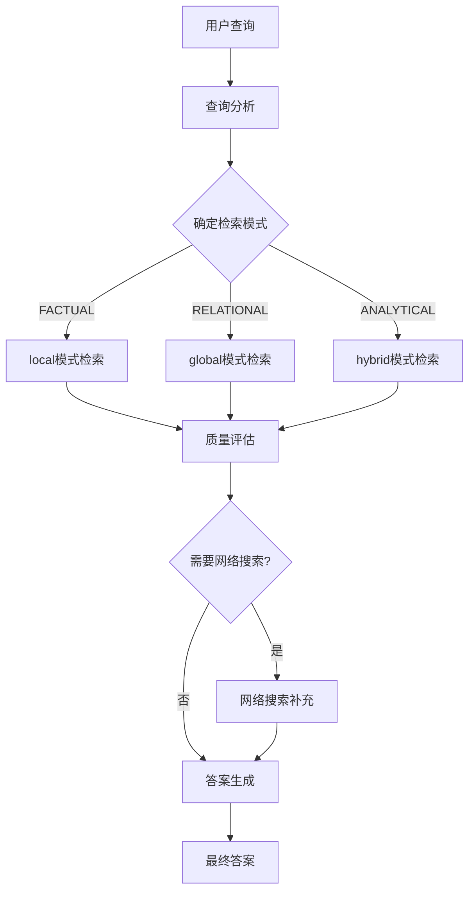

# 智能问答系统 - 项目概览文档

## 文档导航

这是智能问答系统的**入口文档**，提供项目的整体架构概览、核心概念和快速入门指南。详细的技术文档分布在各个模块目录中：

### 🎯 核心技术文档
- **[核心模块详细文档](src/core/README.md)** - 配置管理、状态定义、工作流实现
  - [config.py](src/core/README.md#1-配置管理系统-configpy) - 统一配置管理
  - [state.py](src/core/README.md#2-状态定义-statepy) - LangGraph状态结构
  - [workflow.py](src/core/README.md#3-基础工作流-workflowpy) - 基础工作流实现
  - [enhanced_workflow.py](src/core/README.md#4-增强工作流-enhanced_workflowpy) - 增强工作流实现

- **[工作流节点详细文档](src/agents/README.md)** - 各个AI代理节点的具体实现
  - [查询分析节点](src/agents/README.md#1-查询分析节点-query_analysispy) - 智能查询分类和模式选择
  - [LightRAG检索节点](src/agents/README.md#2-lightrag检索节点-lightrag_retrievalpy) - 多模式知识检索
  - [质量评估节点](src/agents/README.md#3-质量评估节点-quality_assessmentpy) - 检索结果质量评估
  - [网络搜索节点](src/agents/README.md#4-网络搜索节点-web_searchpy) - Tavily API网络搜索
  - [答案生成节点](src/agents/README.md#5-答案生成节点-answer_generationpy) - 多源信息整合

- **[工具模块详细文档](src/utils/README.md)** - 辅助工具和客户端封装
  - [LightRAG客户端](src/utils/README.md#5-lightrag客户端-lightrag_clientpy) - LightRAG接口封装
  - [高级日志系统](src/utils/README.md#2-高级日志系统-advanced_loggingpy) - 结构化日志和性能监控
  - [错误处理框架](src/utils/README.md#3-错误处理框架-error_handlingpy) - 综合错误处理机制
  - [系统监控](src/utils/README.md#4-系统监控-system_monitoringpy) - 健康检查和监控

### 📂 其他模块文档
- **[前端组件详细文档](src/frontend/README.md)** - 前端界面组件和流式处理界面
- **[测试模块详细文档](tests/README.md)** - 测试套件和测试方法
- **[脚本工具详细文档](scripts/README.md)** - 部署和管理脚本

---

## 项目简介

智能问答系统是一个基于**LangGraph**和**HKUDS/LightRAG**构建的先进Agentic RAG系统，支持多模式检索、智能路由和质量评估的完整问答工作流。

### 核心特性
- 🤖 **智能工作流编排** - 基于LangGraph的状态管理和条件路由
- 🔍 **多模式检索** - 支持naive/local/global/hybrid/mix五种HKUDS/LightRAG检索模式
- ⚡ **智能质量评估** - 动态评估检索质量，智能决策是否需要网络搜索
- 🌐 **网络搜索补充** - 集成Tavily API进行实时信息补充
- 🎯 **多层LLM配置** - 支持不同任务使用不同的LLM模型
- 📊 **双应用界面** - 提供完整版和简化版Streamlit应用
- 🛡️ **综合错误处理** - 完善的错误处理、重试机制和监控系统

---

## 项目架构概览

### 目录结构
```
intelligent-qa-system/
├── src/                          # 源代码目录
│   ├── core/                    # 核心模块 - 配置、状态、工作流
│   │   ├── config.py           # 统一配置管理
│   │   ├── state.py            # LangGraph状态定义
│   │   ├── workflow.py         # 基础工作流实现
│   │   └── enhanced_workflow.py # 增强工作流实现
│   ├── agents/                  # 工作流节点 - AI代理实现
│   │   ├── query_analysis.py   # 查询分析节点
│   │   ├── lightrag_retrieval.py # LightRAG检索节点
│   │   ├── quality_assessment.py # 质量评估节点
│   │   ├── web_search.py       # 网络搜索节点
│   │   └── answer_generation.py # 答案生成节点
│   ├── utils/                   # 工具模块 - 客户端和辅助功能
│   │   ├── lightrag_client.py  # LightRAG客户端封装
│   │   ├── simple_logger.py    # 简单日志系统
│   │   ├── advanced_logging.py # 高级日志系统
│   │   ├── error_handling.py   # 错误处理框架
│   │   └── [其他工具文件]      # 更多辅助工具
│   └── frontend/                # 前端组件
│       └── streaming_interface.py # 流式界面组件
├── tests/                        # 测试套件
├── scripts/                      # 脚本工具
├── docs/                         # 文档目录
├── main_app.py                   # 完整版Streamlit应用
├── streamlit_app.py              # 简化版Streamlit应用
├── setup.sh                      # 一键部署脚本
└── requirements.txt              # 依赖列表
```

### 技术架构
- **框架层**: LangGraph (工作流编排) + HKUDS/LightRAG (检索引擎)
- **数据层**: PostgreSQL + pgvector (向量存储) + Neo4j (图数据库)
- **API层**: OpenAI API (多层LLM) + Tavily API (网络搜索)
- **应用层**: Streamlit (Web界面) + Python Backend

---

## 核心工作流程

### 问答处理流程


### 检索模式策略
- **naive模式**: 基础检索模式
- **local模式**: 向量相似度检索，适用于事实性查询
- **global模式**: 图谱关系检索，适用于关系性查询  
- **hybrid模式**: 混合检索，适用于复杂分析性查询
- **mix模式**: 综合模式，结合多种检索策略

---

## 快速开始

### 1. 环境准备
```bash
# 克隆项目
git clone <repository>
cd intelligent-qa-system

# 一键部署（推荐）
./setup.sh

# 或手动安装
pip install -r requirements.txt
```

### 2. 配置设置
复制并编辑环境配置文件：
```bash
cp .env.example .env
nano .env
```

主要配置项：
```env
# 基础LLM配置
LLM_API_KEY=your_api_key
LLM_BASE_URL=https://api.openai.com/v1
LLM_MODEL=gpt-4

# 知识图谱LLM配置
KG_LLM_MODEL=gpt-4o

# 向量LLM配置  
VECTOR_LLM_MODEL=gpt-4o-mini

# 搜索配置
TAVILY_API_KEY=your_tavily_api_key

# 数据库配置
POSTGRES_HOST=localhost
NEO4J_URI=bolt://localhost:7687
```

### 3. 启动应用
```bash
# 启动完整版应用
streamlit run main_app.py

# 或启动简化版应用
streamlit run streamlit_app.py

# 或使用启动脚本
./start.sh
```

---

## 多层LLM配置架构

系统支持为不同任务配置不同的LLM模型：

- **主LLM** (`LLM_MODEL`): 处理对话和最终答案生成
- **知识图谱LLM** (`KG_LLM_MODEL`): 专门处理实体关系提取
- **向量LLM** (`VECTOR_LLM_MODEL`): 处理文档分块和语义理解  
- **嵌入模型** (`EMBEDDING_MODEL`): 文本向量化

这种设计允许针对不同任务选择最适合的模型，平衡性能和成本。

---

## 模块概览

### 核心模块 (src/core/)
- 🔧 **配置管理**: 统一的配置接口和验证 → [详细说明](src/core/README.md#1-配置管理系统-configpy)
- 📊 **状态定义**: LangGraph工作流状态结构 → [详细说明](src/core/README.md#2-状态定义-statepy)
- ⚙️ **工作流引擎**: 基础版和增强版工作流实现 → [详细说明](src/core/README.md#3-基础工作流-workflowpy)

详细信息请参阅: **[核心模块完整文档](src/core/README.md)**

### 工作流节点 (src/agents/)
- 🔍 **查询分析**: 智能查询分类和模式选择 → [实现细节](src/agents/README.md#1-查询分析节点-query_analysispy)
- 📚 **LightRAG检索**: 多模式知识检索 → [实现细节](src/agents/README.md#2-lightrag检索节点-lightrag_retrievalpy)
- ✅ **质量评估**: 检索结果质量评估和决策 → [实现细节](src/agents/README.md#3-质量评估节点-quality_assessmentpy)
- 🌐 **网络搜索**: Tavily API网络搜索补充 → [实现细节](src/agents/README.md#4-网络搜索节点-web_searchpy)
- 💬 **答案生成**: 多源信息整合和答案生成 → [实现细节](src/agents/README.md#5-答案生成节点-answer_generationpy)

详细信息请参阅: **[工作流节点完整文档](src/agents/README.md)**

### 工具模块 (src/utils/)
- 🔌 **LightRAG客户端**: LightRAG接口封装 → [实现细节](src/utils/README.md#5-lightrag客户端-lightrag_clientpy)
- 📝 **日志系统**: 简单日志和高级日志支持 → [实现细节](src/utils/README.md#2-高级日志系统-advanced_loggingpy)
- 🛡️ **错误处理**: 综合错误处理和恢复机制 → [实现细节](src/utils/README.md#3-错误处理框架-error_handlingpy)
- 📊 **系统监控**: 健康检查和性能监控 → [实现细节](src/utils/README.md#4-系统监控-system_monitoringpy)
- 🔧 **辅助工具**: 各种辅助函数和工具类 → [实现细节](src/utils/README.md#6-辅助函数模块-helperspy)

详细信息请参阅: **[工具模块完整文档](src/utils/README.md)**

---

## 部署指南

### 系统要求
- Python 3.8+
- PostgreSQL 12+ (with pgvector extension)
- Neo4j 5.0+
- 8GB+ RAM (推荐)
- 4+ CPU cores

### Docker部署（推荐）
```bash
# 使用Docker Compose
docker-compose up -d

# 或使用一键部署脚本
./setup.sh --docker
```

### 手动部署
详细的手动部署步骤请参阅各模块的具体文档。

---

## 开发指南

### 添加新的工作流节点
1. 在`src/agents/`创建新节点文件
2. 实现符合`AgentState`接口的节点函数
3. 在工作流中注册新节点
4. 配置节点间的路由关系

### 扩展工具模块
1. 在`src/utils/`创建新工具文件
2. 添加适当的错误处理和日志记录
3. 更新相关文档

详细的开发指南请参阅各模块的技术文档。

---

## 故障排除

### 常见问题
1. **配置错误**: 检查`.env`文件和API密钥
2. **数据库连接**: 验证PostgreSQL和Neo4j服务状态
3. **API限制**: 检查API密钥配额和使用情况

### 日志查看
```bash
# 查看应用日志
tail -f logs/app.log

# 查看错误日志
grep ERROR logs/app.log
```

### 健康检查
系统提供了内置的健康检查功能，可通过Web界面或API进行查看。

---

## 版本信息
- **当前版本**: v1.1.0
- **LangGraph**: v0.1.x
- **HKUDS/LightRAG**: latest (从GitHub安装)
- **重要**: 使用`git+https://github.com/HKUDS/LightRAG.git`安装，避免PyPI版本的依赖问题
- **更新日期**: 2024-01-20

---

## 📚 完整文档索引

### 🎯 核心技术实现
| 模块 | 主要功能 | 文档链接 |
|------|----------|----------|
| **核心模块** | 配置、状态、工作流 | [src/core/README.md](src/core/README.md) |
| **工作流节点** | AI代理、检索、评估 | [src/agents/README.md](src/agents/README.md) |
| **工具模块** | 客户端、日志、监控 | [src/utils/README.md](src/utils/README.md) |
| **前端组件** | 界面、流式处理 | [src/frontend/README.md](src/frontend/README.md) |
| **测试模块** | 单元、集成、性能测试 | [tests/README.md](tests/README.md) |
| **脚本工具** | 部署、摄取、测试脚本 | [scripts/README.md](scripts/README.md) |

### 🔧 具体组件索引
| 组件名称 | 功能描述 | 详细文档 |
|----------|----------|----------|
| config.py | 统一配置管理 | [核心模块§1](src/core/README.md#1-配置管理系统-configpy) |
| state.py | LangGraph状态定义 | [核心模块§2](src/core/README.md#2-状态定义-statepy) |
| workflow.py | 基础工作流实现 | [核心模块§3](src/core/README.md#3-基础工作流-workflowpy) |
| enhanced_workflow.py | 增强工作流实现 | [核心模块§4](src/core/README.md#4-增强工作流-enhanced_workflowpy) |
| query_analysis.py | 查询分析节点 | [工作流节点§1](src/agents/README.md#1-查询分析节点-query_analysispy) |
| lightrag_retrieval.py | LightRAG检索节点 | [工作流节点§2](src/agents/README.md#2-lightrag检索节点-lightrag_retrievalpy) |
| quality_assessment.py | 质量评估节点 | [工作流节点§3](src/agents/README.md#3-质量评估节点-quality_assessmentpy) |
| web_search.py | 网络搜索节点 | [工作流节点§4](src/agents/README.md#4-网络搜索节点-web_searchpy) |
| answer_generation.py | 答案生成节点 | [工作流节点§5](src/agents/README.md#5-答案生成节点-answer_generationpy) |
| lightrag_client.py | LightRAG客户端封装 | [工具模块§5](src/utils/README.md#5-lightrag客户端-lightrag_clientpy) |
| advanced_logging.py | 高级日志系统 | [工具模块§2](src/utils/README.md#2-高级日志系统-advanced_loggingpy) |
| error_handling.py | 错误处理框架 | [工具模块§3](src/utils/README.md#3-错误处理框架-error_handlingpy) |
| system_monitoring.py | 系统监控 | [工具模块§4](src/utils/README.md#4-系统监控-system_monitoringpy) |
| helpers.py | 辅助函数模块 | [工具模块§6](src/utils/README.md#6-辅助函数模块-helperspy) |

### 🔄 工作流程快速导航
1. **[查询处理入口](src/agents/README.md#1-查询分析节点-query_analysispy)** → 查询分析和类型识别
2. **[知识检索](src/agents/README.md#2-lightrag检索节点-lightrag_retrievalpy)** → 本地知识库检索
3. **[质量把关](src/agents/README.md#3-质量评估节点-quality_assessmentpy)** → 检索结果质量评估
4. **[信息补充](src/agents/README.md#4-网络搜索节点-web_searchpy)** → 网络搜索补充
5. **[答案输出](src/agents/README.md#5-答案生成节点-answer_generationpy)** → 最终答案生成

---

## 技术支持

如需技术支持或有改进建议，请：
- 查阅相关模块的详细文档
- 检查项目Issues
- 提交新的Issue或Pull Request

---

**📝 注意**: 本文档为项目概览，具体的技术实现细节请参阅各模块目录下的详细文档。