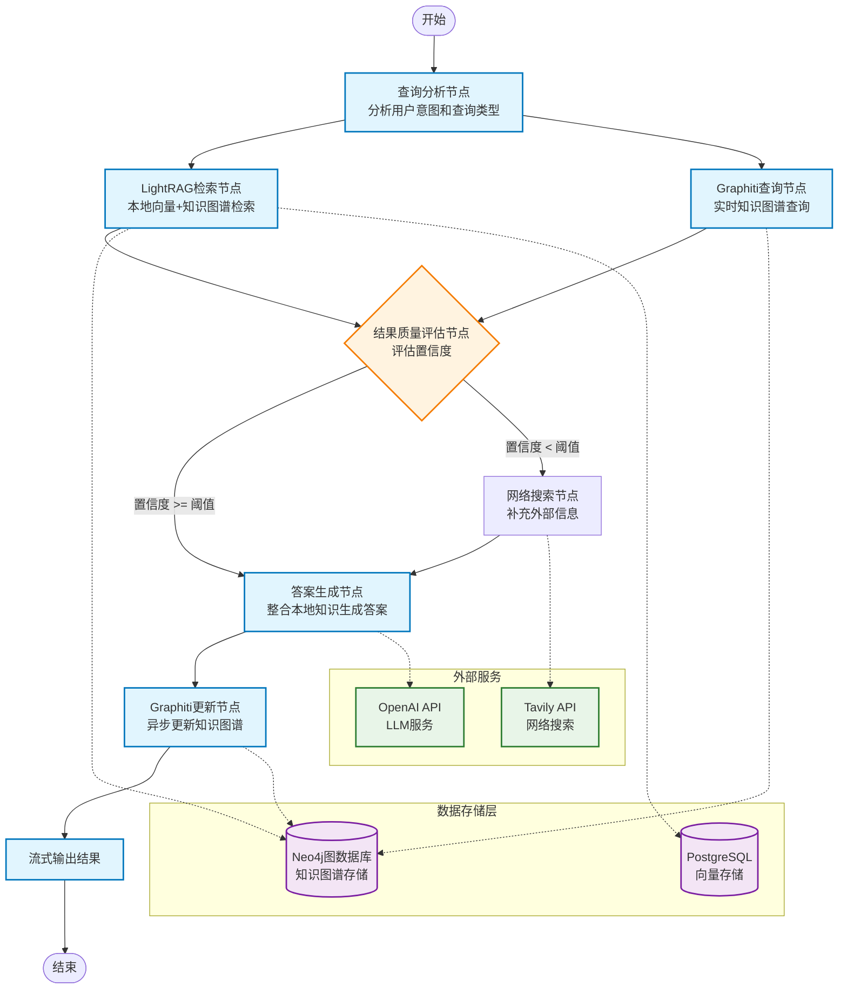
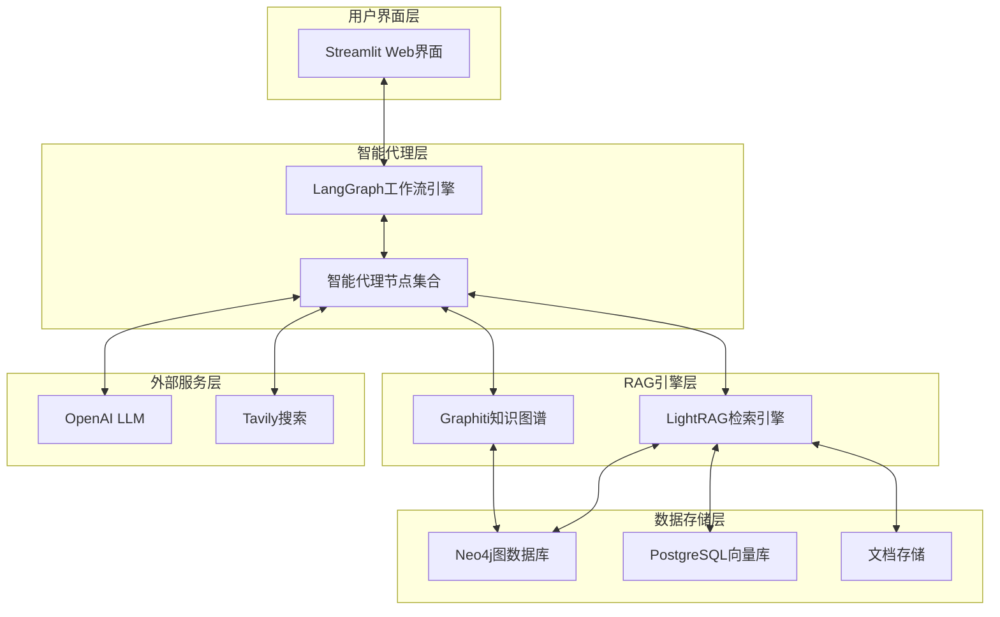

# 智能问答系统技术架构设计文档

## 1. 项目概述与技术背景

### 1.1 项目目标

构建一个基于 Agentic RAG 的智能问答系统，能够自动从本地文档库检索信息，当本地知识不足时智能调用网络搜索，为用户提供准确、全面的答案。

### 1.2 技术背景解释

#### 1.2.1 什么是RAG？

**RAG（Retrieval Augmented Generation）**是一种结合信息检索和生成式AI的技术架构：

- **传统方式的问题**：大型语言模型（LLM）虽然强大，但存在知识截止时间限制，无法获取最新信息，且可能产生幻觉（编造不存在的信息）
- **RAG的解决方案**：在生成答案前，先从知识库中检索相关信息，然后基于检索到的真实信息来生成答案
- **优势**：确保答案基于真实数据，可以整合最新信息，减少幻觉现象

#### 1.2.2 什么是Agentic RAG？

**Agentic RAG**是RAG技术的进化版本，引入了智能代理（Agent）的概念：

- **传统RAG**：检索→生成，流程固定
- **Agentic RAG**：智能代理可以根据查询类型和结果质量，动态决定检索策略、是否需要多轮检索、是否调用外部工具等
- **为什么需要**：不同类型的问题需要不同的检索策略，Agentic RAG可以智能选择最佳路径

#### 1.2.3 技术组件的作用解释

**LightRAG**：

- **作用**：轻量级的RAG框架，处理文档向量化和检索
- **为什么选择**：相比传统RAG，LightRAG结合了向量检索和图检索，能更好地理解文档间的关系

**Graphiti**：

- **作用**：实时构建和更新知识图谱
- **为什么需要**：纯向量检索只能找到相似内容，无法理解实体间的关系。知识图谱能够捕获"谁与谁相关"、"什么影响什么"等关系信息

**LangGraph**：

- **作用**：智能工作流编排引擎
- **为什么需要**：传统RAG是线性流程，LangGraph可以构建复杂的决策树，让系统能够智能选择不同的处理路径

**Neo4j + PostgreSQL**：

- **作用**：Neo4j存储实体关系图，PostgreSQL存储向量嵌入
- **为什么需要两个数据库**：图数据库擅长关系查询，向量数据库擅长相似性搜索，各有所长

### 1.3 核心功能

- **智能问答**：自然语言交互，理解用户意图并选择合适的检索策略
- **本地知识检索**：优先从本地文档库寻找答案，支持向量检索和图谱检索
- **网络搜索补充**：当本地知识置信度不足时，自动调用网络搜索补充信息
- **知识图谱管理**：动态构建和更新知识关系，学习新的实体和关系
- **实时流式显示**：用户可以看到系统的思考过程和信息来源

### 1.4 确定技术栈

#### 核心框架

- **LightRAG**: 轻量级RAG引擎，负责文档处理和向量检索
- **Graphiti**: 实时知识图谱构建和管理
- **LangGraph**: 智能代理工作流编排
- **Neo4j**: 图数据库存储
- **Streamlit**: 前端界面和用户交互

#### 支持组件

- **PostgreSQL + pgvector**: 向量存储
- **OpenAI API**: LLM服务
- **Tavily API**: 网络搜索服务

## 2. 系统架构设计

### 2.1 整体工作流程图



### 2.2 系统架构分层



### 2.3 详细的实现思路解释

#### 2.3.1 为什么需要这样的架构？

**分层设计的优势**：

- **职责分离**：每层专注自己的核心功能，便于维护和扩展
- **可替换性**：比如可以轻松将Streamlit替换为React，或将OpenAI替换为其他LLM
- **并行处理**：LightRAG和Graphiti可以并行检索，提高响应速度

**智能代理的必要性**：

- **动态决策**：根据查询类型（事实查询、关系查询、推理查询）选择不同策略
- **质量控制**：评估检索结果质量，决定是否需要补充搜索
- **错误恢复**：当某个组件失败时，能够选择备用方案

#### 2.3.2 数据流转过程详解

**第一步：查询理解**

```
用户输入 → 查询分析节点 → 确定查询类型和策略
```

- **目的**：理解用户真正想问什么，是寻找具体事实、探索关系，还是需要推理
- **实现**：使用LLM分析查询意图，提取关键实体和关系

**第二步：并行检索**

```
查询意图 → LightRAG检索 + Graphiti查询 → 获取候选答案
```

- **LightRAG检索**：基于向量相似性找到相关文档片段
- **Graphiti查询**：基于实体关系找到相关连接
- **为什么并行**：两种方法各有优势，并行可以获得更全面的信息

**第三步：质量评估**

```
检索结果 → 置信度评估 → 决定是否需要网络搜索
```

- **评估标准**：信息完整性、相关性、权威性
- **阈值设计**：可配置的置信度阈值，平衡准确性和响应速度

**第四步：答案生成**

```
综合信息 → LLM生成答案 → 引用信息来源
```

- **信息融合**：将本地知识和网络搜索结果有机结合
- **来源标注**：清楚标明每个信息点的来源，增强可信度

**第五步：知识更新**

```
新信息 → Graphiti异步更新 → 丰富知识图谱
```

- **学习机制**：系统不断从新查询中学习，更新知识图谱
- **异步处理**：更新过程不影响用户体验## 3. LangGraph节点详细实现

### 3.1 每个节点的功能解释与代码实现

#### 3.1.1 查询分析节点 (QueryAnalysisNode)

**节点作用**：理解用户的查询意图，这是系统的"智能大脑"
**为什么需要**：不同类型的问题需要不同的处理策略

- 事实性问题："什么是机器学习？" → 需要定义和概念
- 关系性问题："谁发明了机器学习？" → 需要人物关系查询
- 推理性问题："机器学习对未来的影响？" → 需要综合分析

```python
from typing import TypedDict
from langgraph import StateGraph
from langchain_openai import ChatOpenAI

class AgentState(TypedDict):
    user_query: str
    query_type: str
    processed_query: str
    local_results: list
    graph_context: dict
    web_results: list
    confidence_score: float
    need_web_search: bool
    final_answer: str
    sources: list

def query_analysis_node(state: AgentState):
    """分析用户查询，判断查询类型和意图"""
    llm = ChatOpenAI(model="gpt-4", temperature=0)
  
    # 查询意图分析提示词
    analysis_prompt = f"""
    分析以下用户查询的类型和意图：
  
    查询：{state["user_query"]}
  
    请判断查询类型：
    1. FACTUAL: 寻找具体事实或定义
    2. RELATIONAL: 探索实体间关系
    3. ANALYTICAL: 需要分析推理
    4. PROCEDURAL: 寻找操作步骤
  
    同时提取关键实体和关键词。
  
    返回JSON格式：
    {{
        "query_type": "类型",
        "key_entities": ["实体1", "实体2"],
        "key_concepts": ["概念1", "概念2"],
        "processed_query": "优化后的查询"
    }}
    """
  
    result = llm.invoke(analysis_prompt)
    analysis = json.loads(result.content)
  
    return {
        "query_type": analysis["query_type"],
        "processed_query": analysis["processed_query"],
        "key_entities": analysis["key_entities"],
        "key_concepts": analysis["key_concepts"]
    }
```

#### 3.1.2 LightRAG检索节点

**节点作用**：从本地文档库进行向量检索和知识图谱检索
**为什么重要**：本地知识是系统的基础，优先使用可信的本地信息

```python
from lightrag import LightRAG

def lightrag_retrieval_node(state: AgentState):
    """从本地知识库检索相关信息"""
  
    # 初始化LightRAG客户端
    lightrag_client = LightRAG(
        working_dir="./rag_storage",
        kv_storage="JsonKVStorage",
        vector_storage="NanoVectorDBStorage", 
        graph_storage="Neo4jStorage",
        neo4j_config={
            "uri": "bolt://localhost:7687",
            "username": "neo4j", 
            "password": "password"
        }
    )
  
    # 混合检索：向量检索 + 图检索
    vector_results = lightrag_client.query(
        state["processed_query"],
        param=QueryParam(mode="local")  # 纯向量检索
    )
  
    graph_results = lightrag_client.query(
        state["processed_query"], 
        param=QueryParam(mode="global")  # 图检索
    )
  
    # 计算检索结果的相关性分数
    relevance_score = calculate_relevance_score(
        vector_results, graph_results, state["processed_query"]
    )
  
    return {
        "local_results": {
            "vector_results": vector_results,
            "graph_results": graph_results,
            "combined_results": combine_results(vector_results, graph_results)
        },
        "retrieval_score": relevance_score
    }

def calculate_relevance_score(vector_results, graph_results, query):
    """计算检索结果的相关性分数"""
    # 基于结果数量、相似度分数、内容质量等计算综合分数
    vector_score = len(vector_results.split('\n')) * 0.6
    graph_score = len(graph_results.split('\n')) * 0.4
  
    # 简化的置信度计算，实际应该更复杂
    total_score = min((vector_score + graph_score) / 10, 1.0)
    return total_score
```

#### 3.1.3 Graphiti知识图谱查询节点

**节点作用**：从动态知识图谱中查询实体关系和事实
**为什么需要**：补充LightRAG的关系推理能力，获取更丰富的上下文

```python
from graphiti import Graphiti

def graphiti_query_node(state: AgentState):
    """查询Graphiti知识图谱获取关系信息"""
  
    # 初始化Graphiti客户端
    graphiti_client = Graphiti(
        neo4j_config={
            "uri": "bolt://localhost:7687",
            "username": "neo4j",
            "password": "password"
        }
    )
  
    # 搜索相关实体
    entities = graphiti_client.search_nodes(
        query=state["processed_query"],
        limit=10
    )
  
    # 搜索相关事实和关系
    facts = graphiti_client.search_facts(
        query=state["processed_query"],
        limit=20
    )
  
    # 构建关系上下文
    relationship_context = build_relationship_context(entities, facts)
  
    return {
        "graph_entities": entities,
        "graph_facts": facts, 
        "relationship_context": relationship_context
    }

def build_relationship_context(entities, facts):
    """从实体和事实构建关系上下文"""
    context = {
        "entity_summary": f"发现 {len(entities)} 个相关实体",
        "fact_summary": f"发现 {len(facts)} 个相关事实",
        "key_relationships": [],
        "temporal_info": []
    }
  
    for fact in facts:
        if hasattr(fact, 'relationship_type'):
            context["key_relationships"].append({
                "source": fact.source_entity,
                "relation": fact.relationship_type,
                "target": fact.target_entity
            })
  
    return context
```

#### 3.1.4 结果质量评估节点

**节点作用**：评估本地检索结果的质量，决定是否需要网络搜索
**为什么重要**：避免不必要的网络搜索，提高响应速度；确保信息充分性

```python
def quality_assessment_node(state: AgentState):
    """评估检索结果质量，决定是否需要网络搜索"""
  
    # 置信度评估标准
    confidence_factors = {
        "retrieval_score": state.get("retrieval_score", 0) * 0.3,
        "entity_coverage": evaluate_entity_coverage(state) * 0.2,
        "content_completeness": evaluate_content_completeness(state) * 0.3,
        "source_authority": evaluate_source_authority(state) * 0.2
    }
  
    total_confidence = sum(confidence_factors.values())
  
    # 动态阈值设置
    if state["query_type"] == "FACTUAL":
        threshold = 0.7  # 事实查询要求较高置信度
    elif state["query_type"] == "RELATIONAL": 
        threshold = 0.6  # 关系查询中等置信度
    else:
        threshold = 0.5  # 分析查询较低置信度
  
    need_web_search = total_confidence < threshold
  
    return {
        "confidence_score": total_confidence,
        "confidence_breakdown": confidence_factors,
        "need_web_search": need_web_search,
        "assessment_reason": f"置信度 {total_confidence:.2f} {'<' if need_web_search else '>='} 阈值 {threshold}"
    }

def evaluate_entity_coverage(state):
    """评估实体覆盖度"""
    expected_entities = state.get("key_entities", [])
    found_entities = state.get("graph_entities", [])
  
    if not expected_entities:
        return 1.0
  
    coverage = len(set(expected_entities) & set(found_entities)) / len(expected_entities)
    return coverage

def evaluate_content_completeness(state):
    """评估内容完整性"""
    local_results = state.get("local_results", {})
    vector_content = local_results.get("vector_results", "")
    graph_content = local_results.get("graph_results", "")
  
    # 简化的完整性评估
    total_length = len(vector_content) + len(graph_content)
    completeness = min(total_length / 1000, 1.0)  # 假设1000字符为完整
    return completeness
```

#### 3.1.5 网络搜索节点

**节点作用**：当本地信息不足时，从网络获取补充信息
**什么时候触发**：质量评估节点判定需要补充信息时

```python
from tavily import TavilySearchAPIWrapper

def web_search_node(state: AgentState):
    """网络搜索补充信息"""
  
    # 只有当需要网络搜索时才执行
    if not state.get("need_web_search", False):
        return {"web_results": []}
  
    # 初始化Tavily搜索
    tavily_search = TavilySearchAPIWrapper(
        tavily_api_key=os.getenv("TAVILY_API_KEY")
    )
  
    # 基于查询类型优化搜索策略
    if state["query_type"] == "FACTUAL":
        search_mode = "factual"
        max_results = 3
    elif state["query_type"] == "ANALYTICAL":
        search_mode = "comprehensive" 
        max_results = 5
    else:
        search_mode = "balanced"
        max_results = 4
  
    search_results = tavily_search.search(
        query=state["processed_query"],
        search_depth=search_mode,
        max_results=max_results,
        include_answer=True,
        include_raw_content=False
    )
  
    # 处理搜索结果
    processed_results = []
    for result in search_results:
        processed_results.append({
            "title": result.get("title", ""),
            "content": result.get("content", ""),
            "url": result.get("url", ""),
            "score": result.get("score", 0),
            "source_type": "web_search"
        })
  
    return {
        "web_results": processed_results,
        "web_search_summary": f"从网络获取 {len(processed_results)} 个补充信息"
    }
  
    answer = llm.invoke(
        f"基于以下信息回答问题：{state['user_query']}\n\n{context}"
    )
  
    # 异步更新知识图谱
    asyncio.create_task(
        graphiti_client.add_episode(
            name="QA Session",
            episode_body=f"Q: {state['user_query']}\nA: {answer}",
            source=EpisodeType.message
        )
    )
  
    return {"final_answer": answer}
```

#### 2.2.2 条件边逻辑

```python
def should_web_search(state: AgentState) -> str:
    """决定是否需要网络搜索"""
    if state["need_web_search"]:
        return "web_search"
    else:
        return "answer_generation"

def route_after_web_search(state: AgentState) -> str:
    """网络搜索后的路由"""
    return "answer_generation"
```

## 3. 技术实现详情

### 3.1 LightRAG 配置与集成

#### 3.1.1 基础配置

```python
from lightrag import LightRAG, QueryParam
from lightrag.llm.openai import gpt_4o_mini_complete, openai_embed
from lightrag.utils import EmbeddingFunc

# 初始化 LightRAG
lightrag_client = LightRAG(
    working_dir="./rag_storage",
    llm_model_func=gpt_4o_mini_complete,
    embedding_func=EmbeddingFunc(
        embedding_dim=3072,
        max_token_size=8192,
        func=lambda texts: openai_embed(
            texts,
            model="text-embedding-3-large",
            api_key=os.getenv("OPENAI_API_KEY")
        )
    ),
    graph_storage="Neo4JStorage",  # 使用Neo4j作为图存储
    vector_storage="PGVectorStorage",  # 使用PostgreSQL向量存储
    chunk_token_size=1200,
    chunk_overlap_token_size=100,
    max_parallel_insert=3,
    llm_model_max_async=12
)
```

#### 3.1.2 文档处理和索引

```python
async def ingest_documents(documents_path: str):
    """批量处理文档并建立索引"""
    await lightrag_client.initialize_storages()
  
    # 读取文档
    documents = load_documents_from_path(documents_path)
  
    # 批量插入
    for doc_batch in batch_documents(documents, batch_size=10):
        await lightrag_client.insert_batch(doc_batch)
  
    print(f"已处理 {len(documents)} 个文档")
```

### 3.2 Graphiti 知识图谱管理

#### 3.2.1 连接配置

```python
from graphiti_core import Graphiti
from graphiti_core.nodes import EpisodeType

# 初始化 Graphiti 客户端
graphiti_client = Graphiti(
    neo4j_uri=os.getenv('NEO4J_URI', 'bolt://localhost:7687'),
    neo4j_user=os.getenv('NEO4J_USER', 'neo4j'),
    neo4j_password=os.getenv('NEO4J_PASSWORD', 'password')
)

await graphiti_client.build_indices_and_constraints()
```

#### 3.2.2 动态知识更新

```python
async def update_knowledge_graph(query: str, answer: str, context: dict):
    """根据问答结果动态更新知识图谱"""
  
    # 添加问答记录作为新的 episode
    await graphiti_client.add_episode(
        name=f"QA_{datetime.now().strftime('%Y%m%d_%H%M%S')}",
        episode_body=f"用户问题: {query}\n系统回答: {answer}",
        source=EpisodeType.text,
        reference_time=datetime.now(timezone.utc),
        source_description="智能问答系统"
    )
  
    # 提取新的实体和关系
    if context.get("new_entities"):
        for entity_data in context["new_entities"]:
            await graphiti_client.create_entity(
                entity_data["name"],
                entity_data["properties"]
            )
```

### 3.3 LangGraph 工作流编排

#### 3.3.1 状态定义

```python
from typing_extensions import TypedDict
from typing import List, Optional

class AgentState(TypedDict):
    user_query: str
    processed_query: str
    query_type: str
    local_results: List[dict]
    graph_entities: List[dict]
    graph_facts: List[dict]
    relationship_context: str
    confidence_score: float
    need_web_search: bool
    web_results: Optional[List[dict]]
    final_answer: str
    session_id: str
```

#### 3.3.2 图构建

```python
from langgraph.graph import StateGraph, START, END
from langgraph.checkpoint.memory import MemorySaver

# 构建工作流
workflow = StateGraph(AgentState)

# 添加节点
workflow.add_node("query_analysis", query_analysis_node)
workflow.add_node("lightrag_retrieval", lightrag_retrieval_node)  
workflow.add_node("graphiti_query", graphiti_query_node)
workflow.add_node("quality_assessment", quality_assessment_node)
workflow.add_node("web_search", web_search_node)
workflow.add_node("answer_generation", answer_generation_node)

# 添加边
workflow.add_edge(START, "query_analysis")
workflow.add_edge("query_analysis", "lightrag_retrieval")
workflow.add_edge("query_analysis", "graphiti_query")
workflow.add_edge(["lightrag_retrieval", "graphiti_query"], "quality_assessment")
workflow.add_conditional_edges(
    "quality_assessment",
    should_web_search,
    {"web_search": "web_search", "answer_generation": "answer_generation"}
)
workflow.add_edge("web_search", "answer_generation")
workflow.add_edge("answer_generation", END)

# 编译图
memory = MemorySaver()
app = workflow.compile(checkpointer=memory)
```

### 3.4 Streamlit 前端实现

#### 3.4.1 主界面设计

```python
import streamlit as st
import asyncio
from datetime import datetime

st.set_page_config(
    page_title="智能问答系统",
    page_icon="🤖",
    layout="wide"
)

st.title("🤖 智能问答系统")
st.markdown("基于 Agentic RAG + LightRAG + Graphiti 的智能问答")

# 侧边栏配置
with st.sidebar:
    st.header("系统配置")
  
    # 检索配置
    retrieval_mode = st.selectbox(
        "检索模式",
        ["hybrid", "local", "global"],
        index=0
    )
  
    confidence_threshold = st.slider(
        "置信度阈值",
        min_value=0.0,
        max_value=1.0,
        value=0.7
    )
  
    # 显示系统状态
    st.header("系统状态")
    if st.button("检查连接状态"):
        check_system_status()
```

#### 3.4.2 实时流式显示

```python
@st.fragment(run_every=0.1)
def stream_response():
    """流式显示响应过程"""
    if "current_stream" in st.session_state:
        stream = st.session_state.current_stream
      
        progress_container = st.container()
        response_container = st.container()
      
        with progress_container:
            col1, col2, col3 = st.columns(3)
          
            with col1:
                st.info("📊 查询分析")
                if stream.get("query_analysis_done"):
                    st.success("✅ 完成")
                else:
                    st.warning("⏳ 处理中...")
          
            with col2:
                st.info("🔍 知识检索")
                if stream.get("retrieval_done"):
                    st.success(f"✅ 找到{stream.get('result_count', 0)}条结果")
                else:
                    st.warning("⏳ 搜索中...")
          
            with col3:
                st.info("🧠 答案生成")
                if stream.get("generation_done"):
                    st.success("✅ 完成")
                else:
                    st.warning("⏳ 生成中...")
      
        with response_container:
            if stream.get("partial_answer"):
                st.write_stream(stream["partial_answer"])

async def process_query(query: str):
    """处理用户查询"""
    session_id = st.session_state.get("session_id", str(uuid.uuid4()))
  
    # 初始化流式状态
    st.session_state.current_stream = {
        "query_analysis_done": False,
        "retrieval_done": False,
        "generation_done": False,
        "partial_answer": "",
        "result_count": 0
    }
  
    config = {"configurable": {"thread_id": session_id}}
  
    # 流式执行工作流
    async for event in app.astream(
        {"user_query": query, "session_id": session_id},
        config=config
    ):
        node_name = list(event.keys())[0]
        node_output = event[node_name]
      
        # 更新进度状态
        if node_name == "query_analysis":
            st.session_state.current_stream["query_analysis_done"] = True
        elif node_name in ["lightrag_retrieval", "graphiti_query"]:
            st.session_state.current_stream["retrieval_done"] = True
            st.session_state.current_stream["result_count"] = len(
                node_output.get("local_results", [])
            )
        elif node_name == "answer_generation":
            st.session_state.current_stream["generation_done"] = True
            st.session_state.current_stream["partial_answer"] = node_output.get("final_answer", "")
```

#### 3.4.3 交互式组件

```python
def main():
    """主界面逻辑"""
  
    # 查询输入
    query = st.chat_input("请输入您的问题...")
  
    if query:
        with st.chat_message("user"):
            st.write(query)
      
        with st.chat_message("assistant"):
            # 使用异步执行
            response = asyncio.run(process_query(query))
          
            # 显示答案
            st.write(response.get("final_answer", ""))
          
            # 显示来源信息
            with st.expander("📚 信息来源"):
                if response.get("local_results"):
                    st.subheader("本地知识库")
                    for result in response["local_results"]:
                        st.write(f"- {result.get('content', '')[:200]}...")
              
                if response.get("web_results"):
                    st.subheader("网络搜索")
                    for result in response["web_results"]:
                        st.write(f"- [{result.get('title', '')}]({result.get('url', '')})")
          
            # 显示知识图谱
            with st.expander("🕸️ 相关实体关系"):
                display_knowledge_graph(response.get("graph_entities", []))

def display_knowledge_graph(entities):
    """显示知识图谱可视化"""
    if entities:
        # 构建图数据
        nodes = []
        edges = []
      
        for entity in entities:
            nodes.append({
                "id": entity["uuid"],
                "label": entity["name"],
                "title": entity.get("summary", "")
            })
      
        # 使用streamlit-agraph显示
        try:
            from streamlit_agraph import agraph, Node, Edge, Config
          
            config = Config(width=600, height=400, directed=True)
            agraph(nodes=nodes, edges=edges, config=config)
        except ImportError:
            st.info("安装 streamlit-agraph 以查看图谱可视化")
            for entity in entities:
                st.write(f"- **{entity['name']}**: {entity.get('summary', '')}")

if __name__ == "__main__":
    main()
```

## 4. 数据库设计

### 4.1 Neo4j 图数据库

#### 4.1.1 节点类型

```cypher
// 文档节点
CREATE CONSTRAINT document_id IF NOT EXISTS FOR (d:Document) REQUIRE d.id IS UNIQUE;

// 实体节点  
CREATE CONSTRAINT entity_id IF NOT EXISTS FOR (e:Entity) REQUIRE e.id IS UNIQUE;

// 问答记录节点
CREATE CONSTRAINT qa_session_id IF NOT EXISTS FOR (q:QASession) REQUIRE q.id IS UNIQUE;
```

#### 4.1.2 关系类型

```cypher
// 文档包含实体
(:Document)-[:CONTAINS]->(:Entity)

// 实体间关系
(:Entity)-[:RELATES_TO]->(:Entity)

// 问答引用实体
(:QASession)-[:REFERENCES]->(:Entity)

// 文档引用关系
(:Document)-[:REFERENCES]->(:Document)
```

### 4.2 PostgreSQL 向量存储

#### 4.2.1 表结构设计

```sql
-- 文档块表
CREATE TABLE IF NOT EXISTS document_chunks (
    id UUID PRIMARY KEY DEFAULT gen_random_uuid(),
    document_id VARCHAR(255) NOT NULL,
    chunk_index INTEGER NOT NULL,
    content TEXT NOT NULL,
    content_vector vector(3072),  -- OpenAI text-embedding-3-large
    metadata JSONB,
    created_at TIMESTAMP DEFAULT CURRENT_TIMESTAMP,
    updated_at TIMESTAMP DEFAULT CURRENT_TIMESTAMP
);

-- 实体向量表
CREATE TABLE IF NOT EXISTS entity_embeddings (
    id UUID PRIMARY KEY DEFAULT gen_random_uuid(),
    entity_id VARCHAR(255) NOT NULL,
    entity_name VARCHAR(500) NOT NULL,
    description TEXT,
    embedding vector(3072),
    metadata JSONB,
    created_at TIMESTAMP DEFAULT CURRENT_TIMESTAMP
);

-- 创建向量索引
CREATE INDEX IF NOT EXISTS document_chunks_vector_idx 
ON document_chunks USING ivfflat (content_vector vector_cosine_ops) 
WITH (lists = 100);

CREATE INDEX IF NOT EXISTS entity_embeddings_vector_idx 
ON entity_embeddings USING ivfflat (embedding vector_cosine_ops) 
WITH (lists = 100);
```

## 5. 部署配置

### 5.1 Docker Compose 配置

```yaml
version: '3.8'

services:
  # 主应用
  qa-system:
    build: .
    ports:
      - "8501:8501"
    environment:
      - OPENAI_API_KEY=${OPENAI_API_KEY}
      - NEO4J_URI=bolt://neo4j:7687
      - NEO4J_USER=neo4j
      - NEO4J_PASSWORD=${NEO4J_PASSWORD}
      - POSTGRES_HOST=postgres
      - POSTGRES_USER=postgres
      - POSTGRES_PASSWORD=${POSTGRES_PASSWORD}
      - POSTGRES_DB=qa_system
    depends_on:
      - neo4j
      - postgres
    volumes:
      - ./data:/app/data
      - ./rag_storage:/app/rag_storage

  # Neo4j 图数据库
  neo4j:
    image: neo4j:5.22.0
    ports:
      - "7474:7474"
      - "7687:7687"
    environment:
      - NEO4J_AUTH=neo4j/${NEO4J_PASSWORD}
      - NEO4J_PLUGINS=["apoc"]
    volumes:
      - neo4j_data:/data
      - neo4j_logs:/logs

  # PostgreSQL + pgvector
  postgres:
    image: pgvector/pgvector:pg16
    ports:
      - "5432:5432"
    environment:
      - POSTGRES_USER=postgres
      - POSTGRES_PASSWORD=${POSTGRES_PASSWORD}
      - POSTGRES_DB=qa_system
    volumes:
      - postgres_data:/var/lib/postgresql/data
      - ./init.sql:/docker-entrypoint-initdb.d/init.sql

volumes:
  neo4j_data:
  neo4j_logs:
  postgres_data:
```

### 5.2 环境变量配置

```bash
# .env 文件
OPENAI_API_KEY=sk-your-openai-api-key
NEO4J_PASSWORD=your-neo4j-password
POSTGRES_PASSWORD=your-postgres-password
TAVILY_API_KEY=your-tavily-api-key

# LightRAG 配置
LIGHTRAG_WORKING_DIR=./rag_storage
LIGHTRAG_CHUNK_SIZE=1200
LIGHTRAG_CHUNK_OVERLAP=100

# Graphiti 配置  
GRAPHITI_MODEL_NAME=gpt-4o-mini
GRAPHITI_EMBEDDING_MODEL=text-embedding-3-large

# 系统配置
CONFIDENCE_THRESHOLD=0.7
MAX_RETRIEVAL_RESULTS=10
WEB_SEARCH_RESULTS=5
```

## 6. 开发指南

### 6.1 项目结构

```
qa_system/
├── app/
│   ├── agents/                 # LangGraph节点定义
│   │   ├── query_analysis.py
│   │   ├── retrieval.py
│   │   ├── quality_assessment.py
│   │   └── answer_generation.py
│   ├── core/                   # 核心组件
│   │   ├── lightrag_client.py
│   │   ├── graphiti_client.py
│   │   └── workflow.py
│   ├── ui/                     # Streamlit界面
│   │   ├── main.py
│   │   ├── components/
│   │   └── utils.py
│   └── config/                 # 配置文件
│       ├── settings.py
│       └── prompts.py
├── data/                       # 数据文件
│   └── documents/
├── scripts/                    # 脚本工具
│   ├── ingest_documents.py
│   └── setup_database.py
├── tests/                      # 测试文件
├── docker-compose.yml
├── Dockerfile
├── requirements.txt
└── README.md
```

### 6.2 启动流程

```bash
# 1. 克隆项目
git clone <repository-url>
cd qa_system

# 2. 配置环境变量
cp .env.example .env
# 编辑 .env 文件

# 3. 启动服务
docker-compose up -d

# 4. 初始化数据库
python scripts/setup_database.py

# 5. 导入文档
python scripts/ingest_documents.py --path ./data/documents

# 6. 启动应用
streamlit run app/ui/main.py
```

### 6.3 扩展开发

#### 6.3.1 添加新的检索节点

```python
def custom_retrieval_node(state: AgentState):
    """自定义检索节点"""
    # 实现自定义检索逻辑
    pass

# 在工作流中添加节点
workflow.add_node("custom_retrieval", custom_retrieval_node)
```

#### 6.3.2 自定义条件边

```python
def custom_routing_logic(state: AgentState) -> str:
    """自定义路由逻辑"""
    if state["custom_condition"]:
        return "custom_node"
    else:
        return "default_node"
```

## 7. 监控和维护

### 7.1 性能监控

- **响应时间监控**: 记录每个节点的执行时间
- **准确率评估**: 定期评估答案质量
- **资源使用监控**: 监控内存、CPU使用情况

### 7.2 日志配置

```python
import logging

logging.basicConfig(
    level=logging.INFO,
    format='%(asctime)s - %(name)s - %(levelname)s - %(message)s',
    handlers=[
        logging.FileHandler('qa_system.log'),
        logging.StreamHandler()
    ]
)
```

### 7.3 数据备份

```bash
# Neo4j 备份
docker exec neo4j neo4j-admin database dump neo4j --to-path=/backups

# PostgreSQL 备份  
docker exec postgres pg_dump -U postgres qa_system > backup.sql
```

---

**文档版本**: v2.0
**最后更新**: 2024-01-XX
**技术栈**: LightRAG + Graphiti + LangGraph + Neo4j + Streamlit
